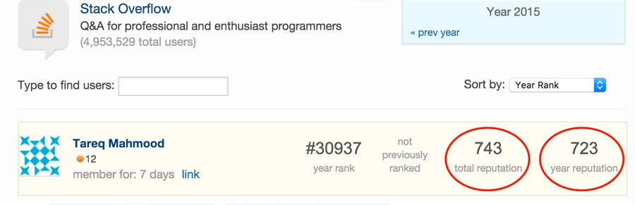
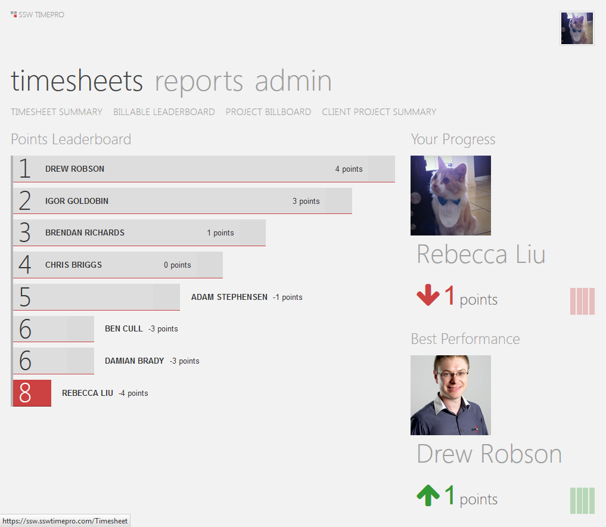
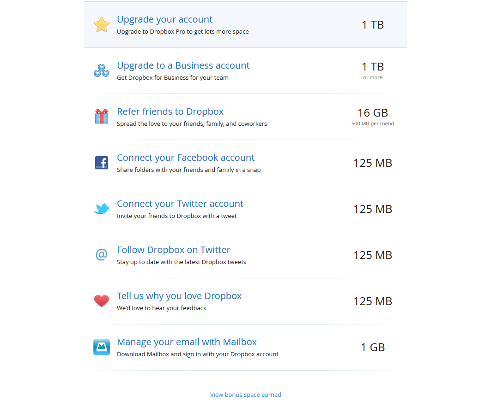

"Gamification" is a method of encouraging user participation. Usually, these are a set of incentives such as points or achievement badges that are linked to some other form of redeemable value.

<!--endintro-->

It originated with Frequent Flyer programs and has crossed over into the software world with the success of Foursquare.

This concept is being utilized even in Visual Studio.

::: good  
  
:::

::: good  
  
:::

::: good  
  
:::

::: good  
  
:::

::: good  
  
:::
