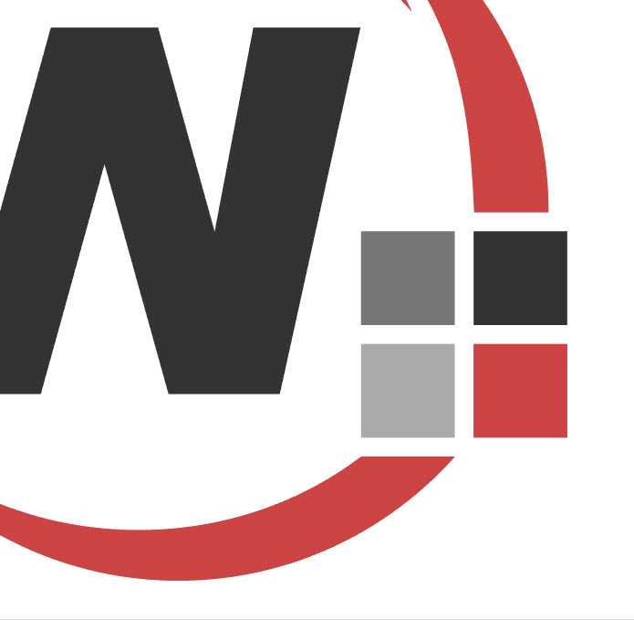

If you've ever wondered why the formats of graphics on the web differ from each other, you're not alone. With various options like SVG, PNG, and JPG, it can be challenging to know which format to use in a particular situation. Choosing the right format is crucial, not just for the aesthetics of your website, but also for its performance and optimization.

<!--endintro-->

## SVG

Stands for "Scalable Vector Graphics".

SVG is best suited for scalable vector graphics, ideal for logos, icons, and illustrations that need to maintain quality at any size or resolution.

✅ **Advantages**

* **Scalability** - SVGs are vector-based, meaning they can be scaled to any size without losing quality. This makes them ideal for logos, icons, and illustrations that need to look sharp on all devices, from mobile screens to large monitors - No pixelation
* **File size** - Since SVGs are based on XML, they often have smaller file sizes compared to raster images, especially for simple graphics
* **Editability** - SVG files can be edited with code or vector graphic software, allowing for easy customization and animation

❌ **Disadvantages**

* **Complexity** - SVGs are not ideal for complex images like photographs, as their file size can increase significantly with added detail
**Browser compatibility** - While most modern browsers support SVGs, there may be limited support for older browsers or devices

### Best use cases

* Logos
* Icons
* Simple illustrations
* Infographics

### Examples

::: bad img-medium
  
:::

::: good  img-medium
  
:::

## PNG

Stands for "Portable Network Graphics".

PNG is best suited for images that require transparency or lossless compression, such as logos, icons, and illustrations with sharp edges.

✅ **Advantages**

* **Transparency** - PNG supports transparent backgrounds, making it perfect for images that need to be layered over other content
* **Lossless compression** - PNGs use lossless compression, meaning they retain all image data, resulting in high-quality images without any degradation
* **Color depth** - PNGs support a wide range of colors and are excellent for images with text, sharp edges, and flat colors

❌ **Disadvantages**

**File size** - PNG files are generally larger than JPGs, especially for complex images, which can slow down page loading times
**Limited animation** - Unlike GIFs, PNGs do not support animation

### Best use cases

* Images with transparency
* Logos and icons where color quality is critical
* Graphics with sharp edges and text

## JPG (AKA JPEG)

Stands for "Joint Photographic Experts Group".

JPG is best suited for photographs and complex images where rich colors and gradients are essential, with some trade-offs in compression and quality.

✅ **Advantages**

* **File size** - JPGs use lossy compression, which significantly reduces file size, making them ideal for large images like photographs
* **Widespread support** - JPGs are widely supported across all browsers and devices, making them a safe choice for most web applications
* **Good for complex images** - JPGs excel at compressing images with complex color variations, like photographs, while maintaining acceptable quality

❌ **Disadvantages**

* **Loss of quality** JPG compression is lossy, meaning that some image data is lost during compression, which can result in a noticeable reduction in quality, especially after multiple edits and saves.
* **No Transparency** - JPGs do not support transparent backgrounds, limiting their use in certain design contexts.

### Best use cases

* Photographs
* Large, detailed images
* Web banners

### Examples

::: bad  
  
:::

::: bad  

:::

::: good  
  
:::

## WebM

Stands for "Web Media File Format".

WebM is best suited for high-quality animations and video where performance and file size efficiency are crucial.

✅ **Advantages**

* **Superior compression** - WebM uses advanced video codecs like VP8 and VP9, allowing for higher compression without a significant loss in quality, resulting in smaller file sizes compared to GIFs
* **High quality** - WebM supports full-color depth (24-bit) and high frame rates, making it ideal for high-quality animations and video with smooth playback and vibrant color
* **Audio support** - Unlike GIFs, WebM files can include audio, offering a more versatile option for multimedia, tutorials, or short clips that require sound
* **Performance efficiency** - WebM is optimized for efficient playback, reducing CPU usage and battery drain, especially important for mobile devices

❌ **Disadvantages**

* **Limited compatibility** - WebM is not supported by all web browsers (e.g., older versions of Safari and Internet Explorer), which can lead to accessibility issues without fallback options like MP4 or GIF
* **More complex implementation** - Embedding WebM requires more knowledge and effort than GIFs, particularly if fallback formats are necessary for cross-browser compatibility

### Best use cases

* Video-based animations with audio
* High-resolution web animations (e.g., UI/UX interactions, tutorials)
* Short videos with complex visuals or gradients that would be degraded in GIF format

## GIF

Stands for "Graphics Interchange Format".

GIFs are appropriate for simple, short loops where universal compatibility and quick implementation are key.

✅ **Advantages**

* **Animation** - GIFs are widely known for their ability to support simple animations, making them a popular choice for memes, short looping videos, and animated icons
* **Transparency** - Like PNGs, GIFs support transparency, although the transparency is binary (fully transparent or fully opaque), which can lead to jagged edges in some cases
* **Widespread support** - GIFs are supported across all major web browsers and devices, ensuring compatibility

❌ **Disadvantages**

* **Limited color palette** - GIFs are restricted to a 256-color palette, which makes them less suitable for complex images or photographs that require rich color depth
* **File size** - Animated GIFs can be quite large in file size, which may slow down page loading times, especially if multiple GIFs are used
* **Quality** - Due to the limited color palette and lossy compression, GIFs are not ideal for high-quality images or graphics with subtle gradients

### Best use cases

* Simple animations (e.g., loading spinners, small banners).
* Memes and short video clips
* Low-color images with transparency

### Optimization tips for GIFs

If you decide to use GIFs on your website, here are some optimization tips to ensure they don't negatively impact performance:

* **Reduce the number of frames** - Fewer frames can lead to a smaller file size without drastically affecting the animation quality
* **Optimize colors** - Use tools to reduce the color palette of your GIF to the minimum needed for acceptable quality
* **Labeling GIF's when necessary** - When adding a GIF, remember to specify that it is a GIF to differentiate it from a static image

::: info
**Note:** For more complex animations, consider using CSS animations or other formats like WebM (see above) or MP4, which offer better compression and quality.
:::

## BMP

Stands for "Bitmap Image File".

❌ **Avoid BMPs for web use**

While BMPs offer high-quality images, their large file sizes and lack of compression make them unsuitable for web applications. If you need high-quality images, consider using PNG or JPG instead.

---

## Choosing the Right Format

Understanding the strengths and weaknesses of each format can help you make informed decisions when adding images to your website. Here are some general guidelines:

* **SVGs** for graphics that need to be scalable and maintain clarity across all screen sizes, like logos and icons
* **PNGs** when you need transparency or when dealing with images that require high-quality, lossless compression
* **JPGs** for photographs and other complex images where a balance between quality and file size is important
* **GIFs** for simple animations, low-color images, or when you need a format that supports basic transparency. GIFs are a go-to for creating engaging, lightweight animations and small graphics

::: info
**Tip:** Regardless of the format you choose, [optimizing your images](optimize-your-images) is key to ensuring fast loading times and a smooth user experience.
:::
