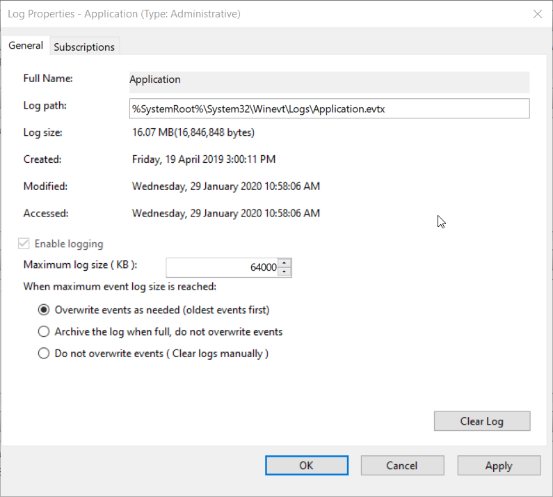

Change the defaults from 20480KB to 64000KB and Overwrite as needed. This will allow the users to view Security audits and errors much further into the past with a minimal increase in space - and it will never bloat your server.

<!--endintro-->

::: bad  
  
:::

::: good  
  
:::
