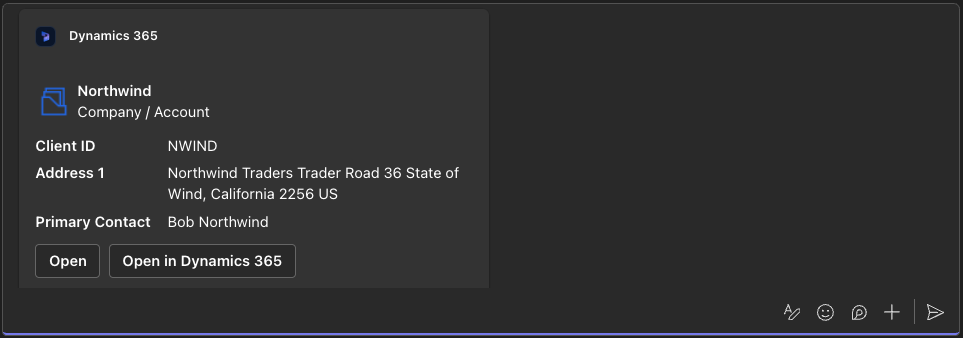
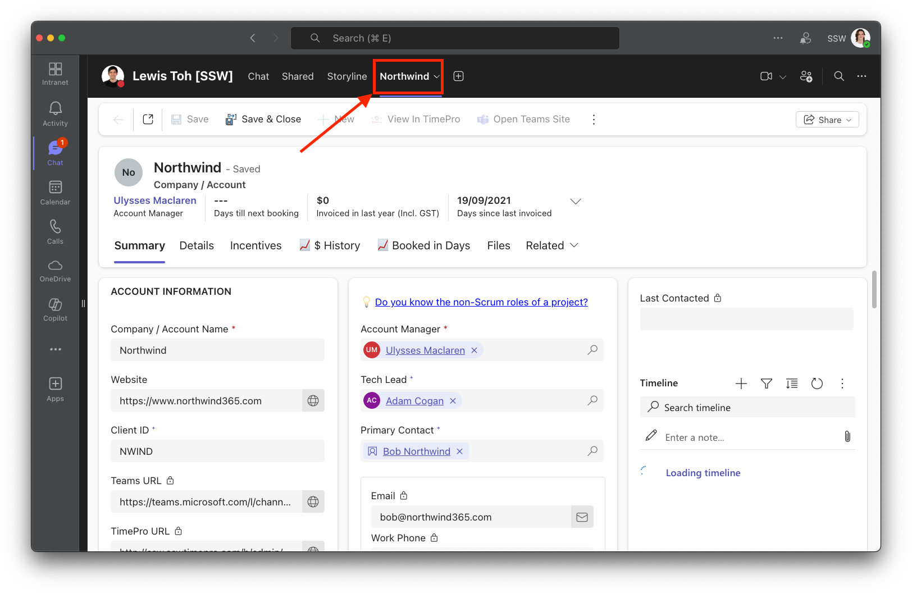

The Dynamics 365 app for Microsoft Teams lets you share records with colleagues without leaving the app. Instead of sharing non-descriptive URLs, use the integration to provide more context.

<!--endintro-->

::: bad

:::

There are two ways to share a Dynamics 365 record in Teams:

## 1. Share in a chat

You can quickly share a record in a conversation.

Click the **+ button** in the text box | **Dynamics 365** | **choose a record** | **Send**.

::: good

:::

## 2. Add as a tab

If your team needs frequent access to a record, you can add it as a tab.

Click the **+ button** in the top bar | **Dynamics 365** | **choose the record** | **Save**.

::: good

:::
