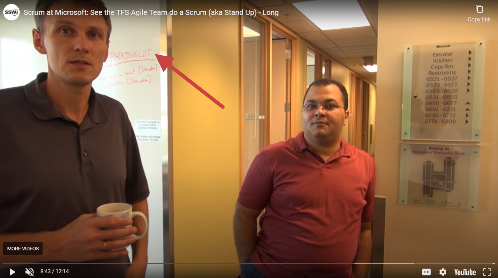

Make sure that you cover as much of the agenda as possible within the timebox, and keep other topics to a minimum.

When you identify topics that do need to be hashed out, but are off topic and don't need to be covered in this meeting, keep track of them in a “Parking Lot”.

E.g. During the meeting you can call out _“Off topic. I think that topic should be saved for the “Parking Lot”. Who is interested in joining that?”_

<!--endintro-->

See it in the video at around [9:00](https://youtu.be/-UUrLxNBK_g?si=XKIktpJI3StVHJhG&t=543)
