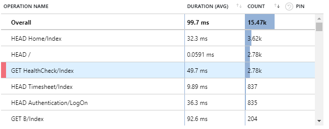
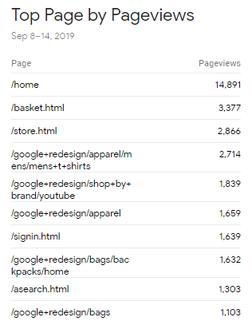

Measuring which pages receive the most hits will help a great deal when looking to optimise your website.

- Measuring usage will help to determine the current business value of a page or feature
- Optimising a highly used page will have a higher impact on overall system performance

A number of great tools exist to find the highest hit pages.

<!--endintro-->

