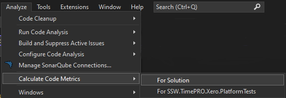
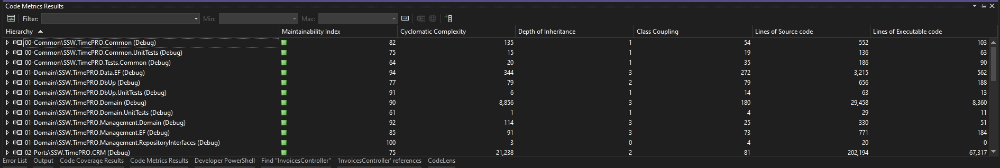

You should generally be looking for ways to simplify your code (e.g. removing heavily-nested case statements). As a minimum, look for the most complicated method you have and check whether it needs simplifying.

In Visual Studio, there is built-in support for Cyclomatic Complexity analysis.

<!--endintro-->

1. Go to Analyze | Calculate Code Metrics | For Solution

2. Look at the function with the largest Cyclomatic Complexity number and consider refactoring to make it simpler.

:::greybox

**Tip:** Aim for "green" against each function's Maintainability Index.
:::
