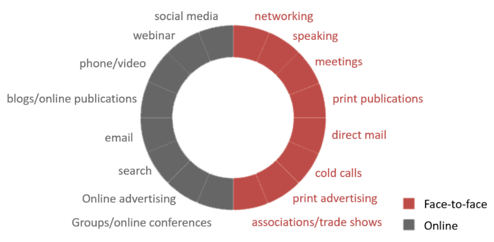

Marketing efforts are the resources you dedicate to promoting your products and services. Through marketing activities, like posting on social media, or paying for advertising, a company can create demand and interest in its items and gain greater visibility with potential customers.

<!--endintro-->

Before deciding on your effort or resources, you need to ask yourself some important questions:

- What are your current marketing efforts?
- What do you need to do with your branding to get new clients?
- How you have to communicate on social media with all your target audience to achieve your marketing goals?
- Which social media platforms do you really need to use?

The ‘effort’ is the daily tasks you will complete to achieve your goals, for example:

- Planning and posting content on social media
- Engaging with your audience
- Booking photo sessions of your products
- Writing blog posts
- Researching bloggers
- Partners and digital influencers to work with your business
- Creating and managing your SEM campaigns
- Organizing events

It's in this phase that you’ll basically decide on what activities you will use to help achieve your goals.

