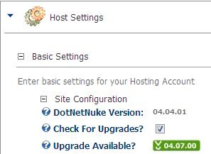
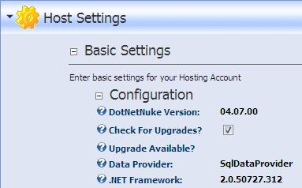

You can check your DNN version via the "Host Memu", then "Host Settings" and tick the "Check For Upgrades" check box to see the latest version

<!--endintro-->

::: bad

:::

::: good

:::

It would be nice if DNN version can be checked by [Better way of checking DotNetNuke version on 'DotNetNuke Suggestions'](https://ssw.com.au/ssw/Standards/BetterSoftwareSuggestions/DotNetNuke.aspx#Version).
