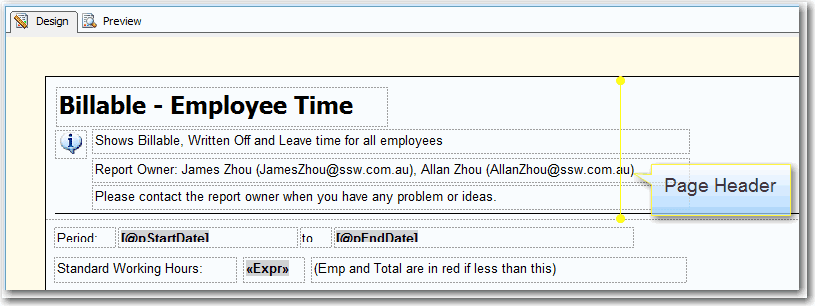
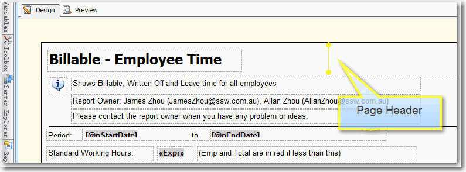

Things in a report page header repeat on every page. To avoid duplicate and save paper when printing, we put content as less as possible in the header.

<!--endintro-->

::: bad  
  
:::

::: good  

:::
