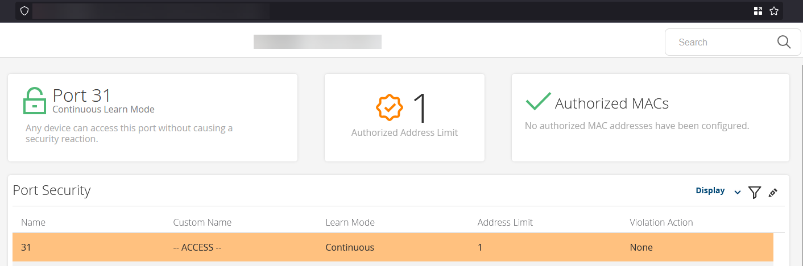
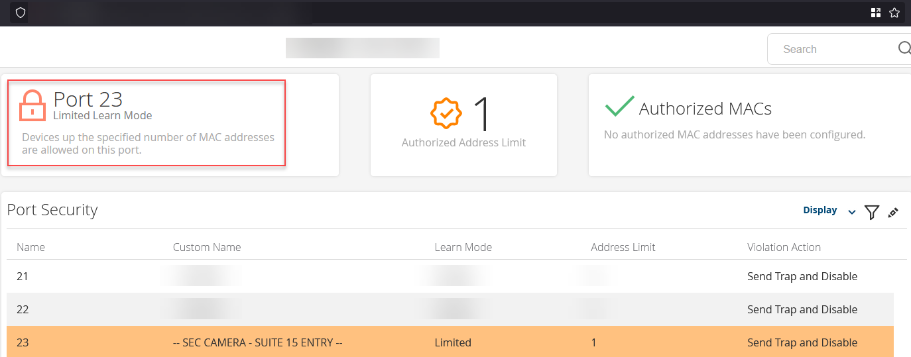

Have you ever faced a scenario where an unauthorized device is discreetly connected to an open port on your network switch, potentially intercepting sensitive data or disrupting critical services? This situation isn’t just theoretical - it can lead to serious security breaches, data theft, and system downtime if you do not restrict the MAC addresses allowed to connect.        

<!--endintro-->

::: bad

:::

An open switch port accepts any device, allowing a malicious actor to connect and compromise internal systems.

::: good

:::

## Benefits of limiting MAC addresses on network switches

* **Increased security** - Restricts unauthorized hardware from accessing sensitive resources
* **Stronger perimeter** - Keeps dangerous devices from infiltrating your network, especially at high-risk access points like camera ports
* **Data protection** - Maintains the integrity and confidentiality of your data by ensuring only trusted devices connect

### Particularly Vulnerable: Camera Ports

Outdoor or easily accessible camera ports are prime targets, as attackers can physically connect rogue devices to these less protected areas. By setting static or pre-approved MAC addresses on these ports, you ensure only the intended camera is allowed—keeping bad actors out.

Together with other security standards like [keeping your networks separated via Virtual LANs](/separate-networks/) and [using Intrusion Prevention Systems](/do-you-use-network-intrusion-prevention-systems/), your network should always be tested and protected against malicious actors in the wild.
