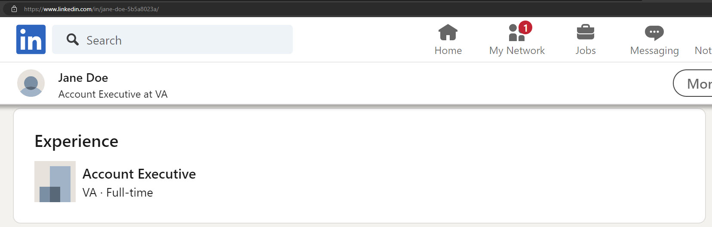
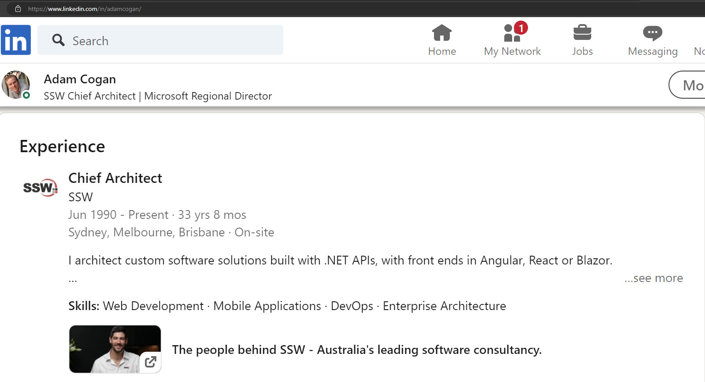

Consider this: You meet a consultant at a conference who seems to be a perfect fit for your big project. You look them up on LinkedIn, but their profile has no job history. Most people would feel skeptical if this happened - and they might not hire that consultant. Here's the quick way to give your profile credibilty:

<!--endintro-->

## Value of adding experience

* **Credibility** - It showcases your career progression, skills, and areas of expertise
* **Visibility** - LinkedIn's algorithm favors profiles with more job history. This means you're more likely to appear in search results

### How to add job experience

1. Add a position (or edit an existing position)
2. Fill out the fields:

* Job title (see [Do you prefix your job title with the company name?](/prefix-job-title))
* Dates
* Location
* Skills
* Media - E.g. a video of your office

::: bad

:::

::: good

:::
