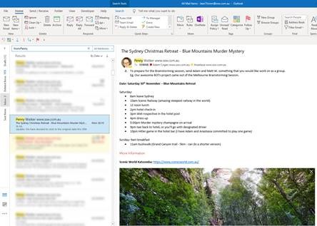
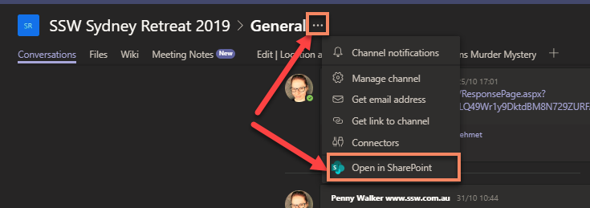
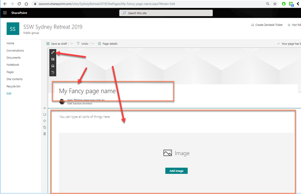
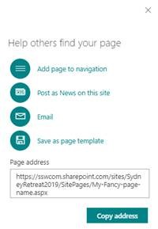
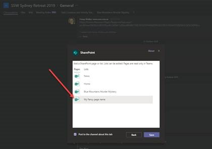

Some information sent via email, such as an event agenda will often be accessed multiple times by recipients. Instead of having to search through your mailbox every time you need the details of an invitation, if you are using Microsoft Teams you can easily set up a page as a tab inside your Team.

<!--endintro-->

A SharePoint page can also have dynamic content such as Document Library views, Youtube players, and much more. You can even embed your own custom web parts, rendered in Teams with full fidelity.

::: bad  
  
:::

::: good  
  
:::

To set up a SharePoint Page as a Tab in Teams, follow these steps:

1. Navigate to SharePoint:

2. Create a SharePoint page

3. Customize it

4. Publish it (tips: you can even share it via Email or Promote it as a News)

5. Go To Teams and Add new Tab

6. Select “SharePoint”

7. Select the page you just published and hit “save”

