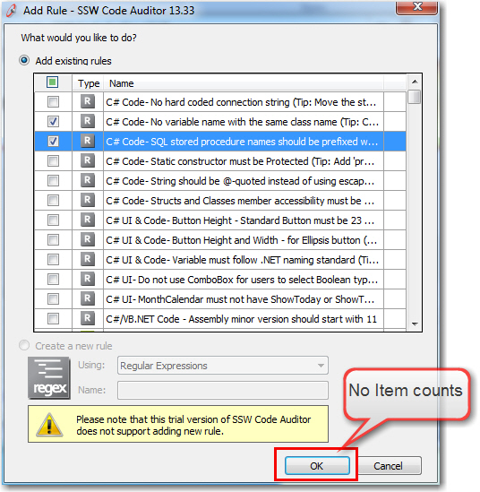
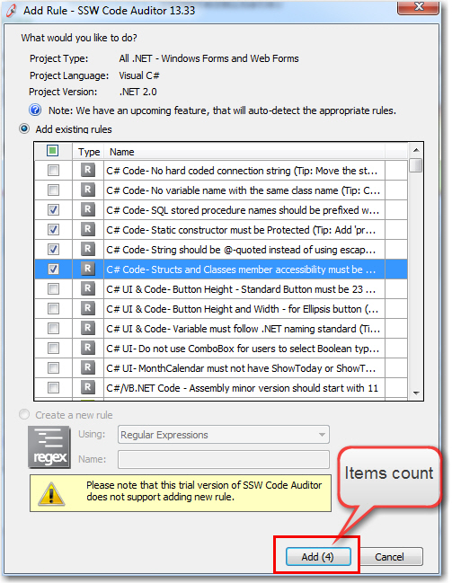

You don't want someone hitting a delete button by accident. You don't want a use clicking delete expecting a record to be deleted and 10 are deleted.

Aim to make your delete button red and add the count into button text, so the user will be empowered before hitting that fateful delete button.

<!--endintro-->

::: bad

:::

::: good

:::

::: good

:::
