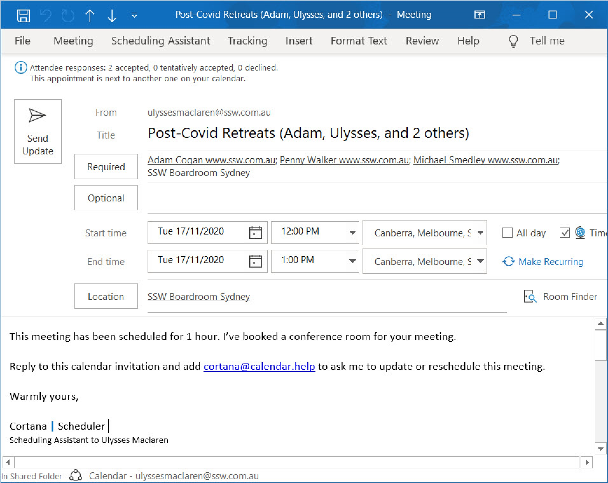
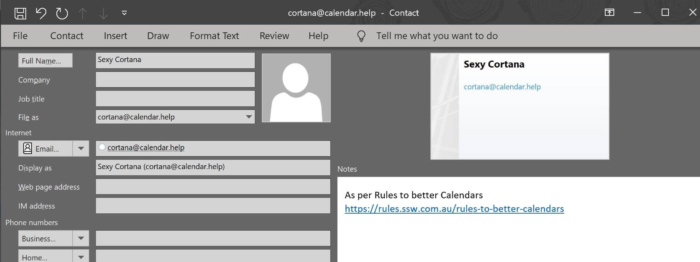
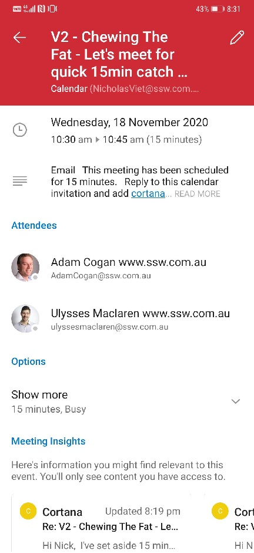

::: info
**Important:** [Cortana is deprecated](https://support.microsoft.com/en-us/topic/end-of-support-for-cortana-d025b39f-ee5b-4836-a954-0ab646ee1efa).
:::

<!--endintro-->

## How to use Microsoft Cortana Scheduler (formerly known as Calendar.help)

This option is best if you're OK to meet any time that your calendar says is free.

**Note:** The helpful tool Scheduler has a portal too at calendar.help/user/dashboard

### Instructions to use Cortana

#### Step 1 - Register

Register yourself at Meet Scheduler before you can use this feature.

#### Step 2 - Send an email

Open an email... not an appointment!

::: email-template  
|          |     |
| -------- | --- |
| To:      | Adam |
| Cc:      | Cortana |
| Subject: | Talk about Northwind project |  
::: email-content  

### Hi Adam

We need to talk about Northwind project.

--

<mark>Cortana, schedule a meeting.</mark>

:::  
:::  
**Figure: after your message, add some request to Cortana as you would a PA**

Cortana then handles all the back-and-forth emails to find a time when everyone can meet and then she sends out an invite on your behalf.

#### Step 3 - Add Cortana as a contact

To make it easier to add Cortana to your emails, create a Contact.

✅ Works great on mobile:

