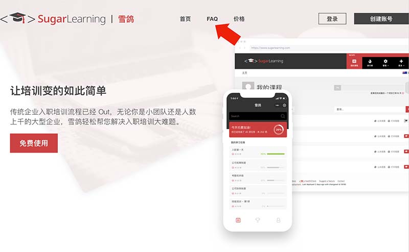
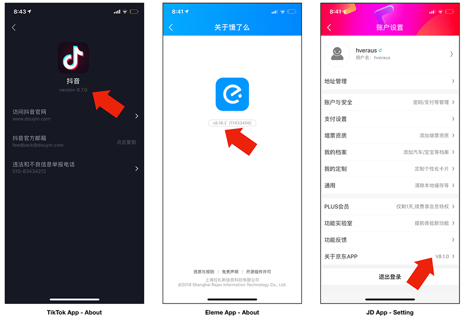
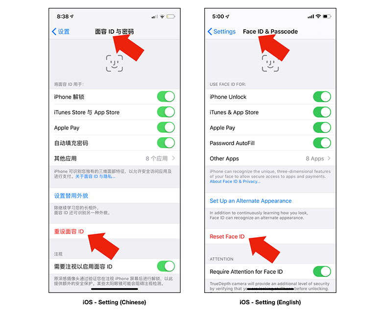

If you are localizing your application to China, some of the English words are commonly used in China. Instead of translating a word to Chinese bluntly, you should keep them in English.

<!--endintro-->

Here is a list of English words which are OK to use on your user interface:

* OK
* APP
* FAQ
* VS
* V1, V2 (Version 1, Version2)
* ID
* VR
* AI
* 3D

::: good

:::

::: good

:::

::: good

:::

::: good

:::
