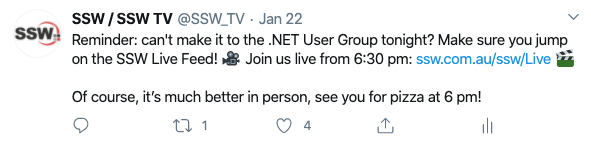

Posting regularly on social media is important to continue to build your brand and engage with your customer base.

<!--endintro-->

The best social media posts always include an image or a video, as this is more engaging for your users and helps your followers to associate with your brand more easily. You should try and vary these images depending on the text of the post, for example, a post about an event would be complemented by a promotional image for the event or shots from previously held events.

Social Media Strategist [Jeff Bullas reports that Facebook posts](https://www.jeffbullas.com/6-powerful-reasons-why-you-should-include-images-in-your-marketing-infographic/) with photos receive an average 37% increase in engagement, and Buzzsumo found that [posts with images receive 2.3 times more engagement](http://buzzsumo.com/blog/how-to-massively-boost-your-blog-traffic-with-these-5-awesome-image-stats/) than those without.

Be aware that just sharing random or any images will not set your social media apart from your competitors. You have to think of several aspects of the photo/video, such as:

- Quality of image
- Framing, composition, perspective, and style - See [Do you know how to take great photos for your socials?](/know-how-to-take-great-photos-for-your-socials)
- Text application on the image - See [Branding - Do you know when to use an overlay on images?](/branding-do-you-know-you-should-use-overlay-on-photos-shared-on-your-social-media) and [Do you know the text limit for images?](/text-limit-for-images)
- Following the business's branding

::: bad

:::

::: good

:::
