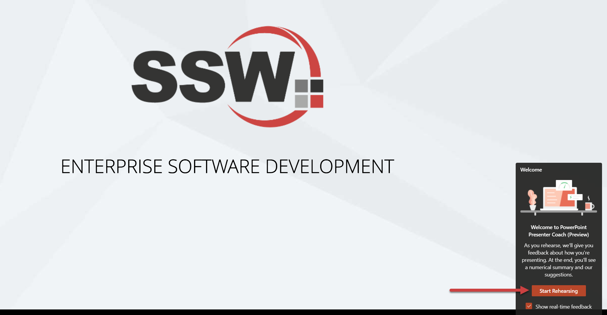
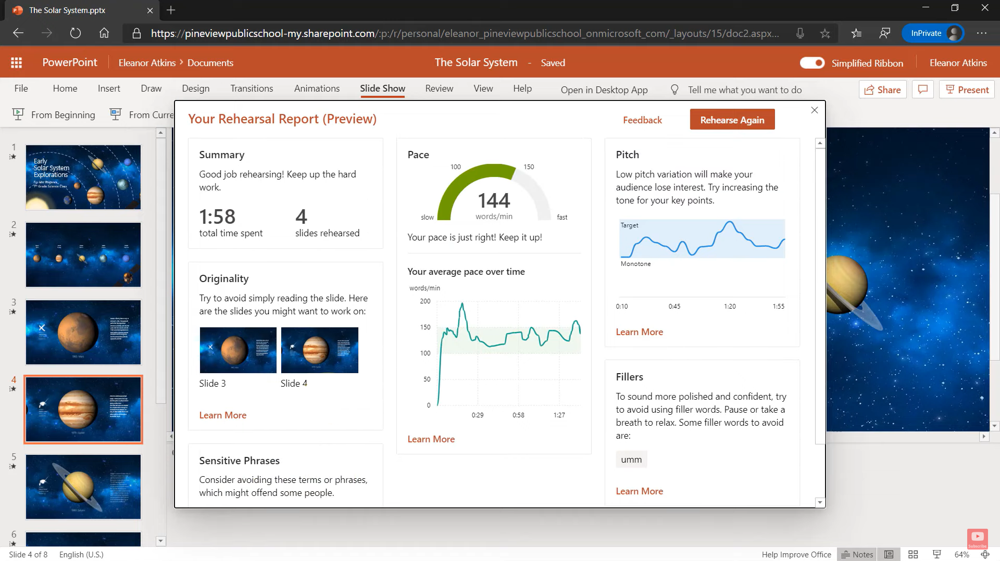

So you have a shiny PowerPoint deck with heaps of great content, and you know what you want to say! Are you ready to present? No, not yet.

You need to practice it so that you know your stuff backwards as well as forwards.

<!--endintro-->

`youtube: https://youtu.be/jPwNwNdE7pE`

::: good
**Video: Good example - Practice your content forwards and backwards to be as good as Victor Borge**
:::

These 5 steps can improve the delivery of a speech immensely (inspired by [Vinh Giang](https://www.vinhgiang.com/)):

1. Record the "Test Please"
2. Do an audio audit – play the recording, only listen to the audio (don’t look at the video)
   * Are you speaking too fast/too slow?
   * Are you pausing appropriately?
   * Voice stressing/pausing on important points?
   * Are you too loud/too soft?

3. Do a visual audit – play the recording, this time looking at the video only (turn down the volume to zero, so that you can’t hear the audio)

   * How is your body language?
   * Moving your hands less/more? (more hand movement means more distraction) Eye contact?
   * Posture?
   * Are you smiling or do you look stunned?

4. Use a transcript generator and get your speech printed on paper. (Include all the words)
   * Cut off the unwanted words that do not add meaning
   * Identify how many times you use "umms", "you know", and repetitive words that we all have a habit of using

5. Practice by cutting out unnecessary repetition and filler words

## PowerPoint's "Rehearse with Coach"

You can use PowerPoint's built-in AI "Rehearse with Coach" to get help with some of the above. It gives you **instant feedback** on how fast you are talking and what language you are using, so you can **avoid unwanted words**. In the video below Mike Tholfsen shows you how to use the feature and what feedback you get.

`youtube: https://youtu.be/tGkANWhoo0Y`
**Video: How to use Presenter Coach in PowerPoint for the web (2 min)**

To get started you'll need a Microsoft PowerPoint presentation. Click the tab **Slide Show | Rehearse with Coach | Start Rehearsing**.

You can find more information on Microsoft's support page, [Rehearse your slide show with Speaker Coach](https://support.microsoft.com/en-us/office/rehearse-your-slide-show-with-speaker-coach-cd7fc941-5c3b-498c-a225-83ef3f64f07b).
