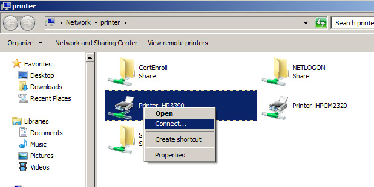

For PCs that are not in the domain, the printers won’t be automatically installed.

So you should add a DNS alias which maps \\printer to your print server.

<!--endintro-->

::: greybox
Note: It is better to automate mappings via GPO preferences. As a backup, you can allow users to manually map as above.  
:::
