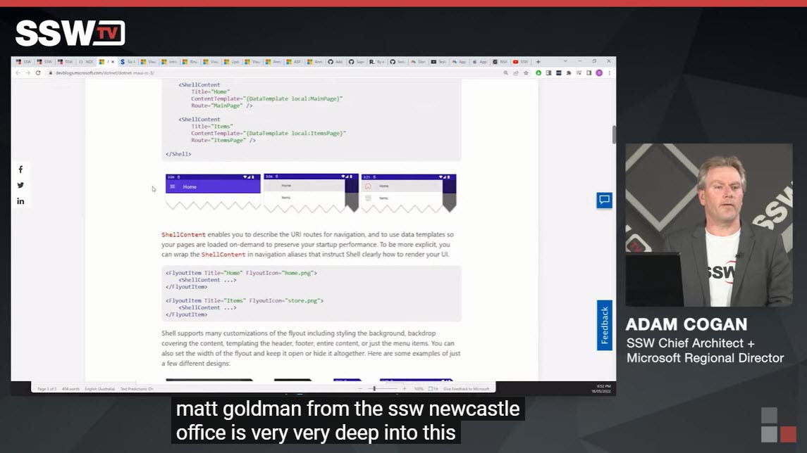

There are a number of reasons you may want to subtitle your video. Sometimes, the audio recording is too low, and adding gain to the audio will introduce unwanted noise. In this instance, you want to add subtitles using your editing program.

<!--endintro-->

Use the following:

::: good

:::
