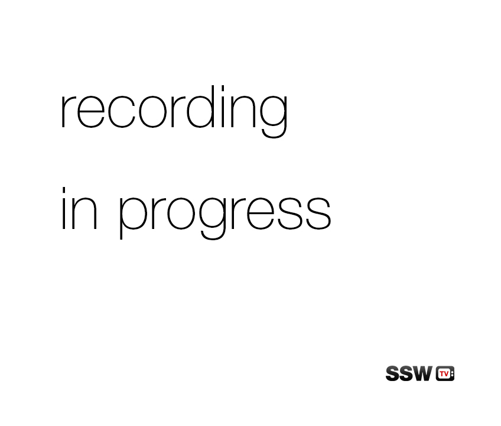

Unwanted noises such as people walking and talking can ruin a recording. If you have this problem, the best way to avoid it is to use a recording in progress sign that informs people who are passing through the area that they need to be quite and/or leave the area.

<!--endintro-->

Figure: Bad Example - This design does not imply a sense of alert. You need something that is going to catch the attention of people and imply an important message.

Figure: Good Example - this implies a sense of urgency, it implies 'we are recording so don't make noise or ruin the shoot in any way', instead of 'we are shooting and it's really cool so come check it out!'.
