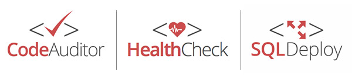

At SSW, after consulting, the second tier of our business are the [software products](https://www.ssw.com.au/ssw/Products/ProdCategoryList.aspx). It should be obvious, as soon as our software is run, which company built the application. And more than just plonking the logo in the corner - the app should be recognizable even if the logo has been taken away.

<!--endintro-->

Here are some of the basics of our software:

- Company logo on footer and credits
- Product logo on top of main screens (the different software and products logos should be consistent with each other)
- Consistent colors and fonts throughout the whole application

The setup and software icon for your applications should also be branded.

If you have many products, keep them consistent.

::: good  
  
:::
