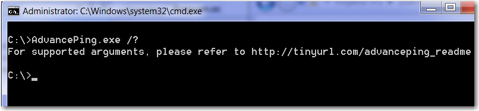
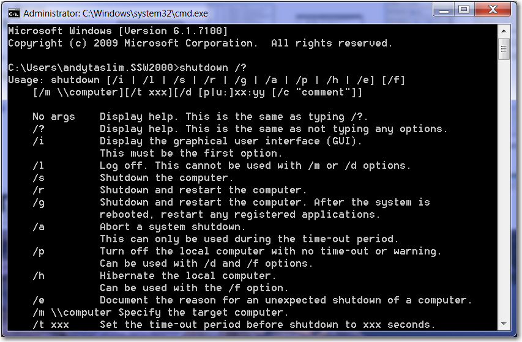

When you develop an application that supports command line, you must provide a list of arguments / help on how to use the application through command line.

It can be as easy as typing: `\[ApplicationName].exe /?` for listing the arguments.

<!--endintro-->

::: bad

:::

::: good

:::
