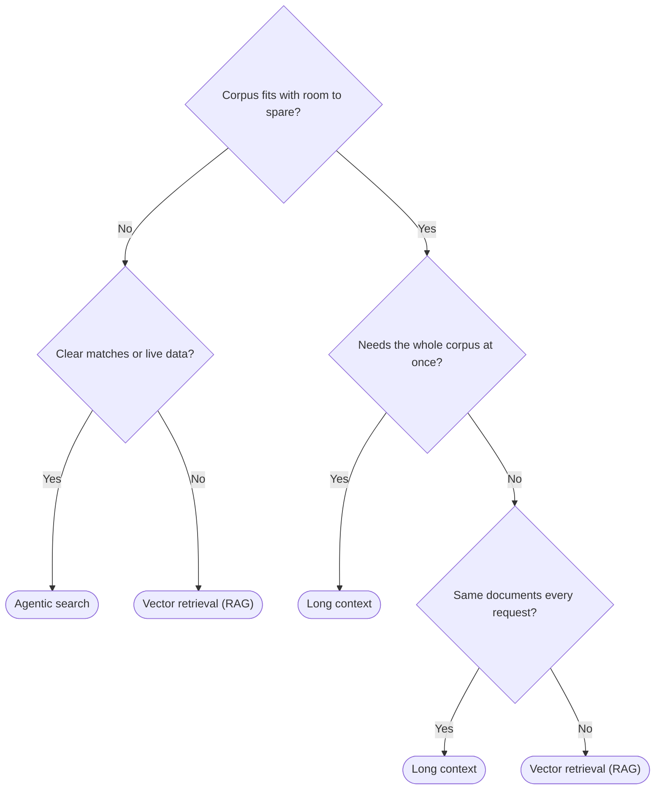

Your AI solution needs data: your codebase, your support docs, your policies.

How the model reaches it decides your cost per query, latency, and the ability to cite sources. RAG was the clear choice for this not too long ago, but now there's some nuance to this decision… with the decision often coming down to corpus size and how dynamic it is.

<endIntro />

<youtubeEmbed url="https://www.youtube.com/watch?v=UabBYexBD4k" description="Video: Is RAG Still Needed? Choosing the Best Approach for LLMs (11 min)" />

## Long context

The newest options. Context windows reaching up to and over a million tokens turned "just put it all in the prompt" into an intuitive, simple option. There's no index, no embedding pipeline, no sync job, that you would have to set up as with RAG. It's also the only strategy that reasons across the whole corpus at once - which is what you need for a question like *which security requirements never made it into the release*, where the answer is the gap between two documents rather than a passage inside either one.

It has caveats worth knowing. Accuracy [sags in the middle](https://arxiv.org/abs/2307.03172) of a long window. On multi-hop questions, performance [collapses to the least visible fact](https://arxiv.org/abs/2601.12499) - one badly-positioned hop can derail the conversation.

### Making long context economical

Long context becomes even better when accounting for caching. Caching keys on how a prompt *starts*, not the whole thing. Put the documents at the front and the user's question at the end, and every request opening with those same documents reuses the cached copy at a fraction of the price, independent of the following question. See [prompt caching](/do-you-follow-best-practices-for-prompt-caching).

That discount is what makes putting a whole corpus into every request affordable, so the ordering is an important design decision here.

## Vector retrieval (RAG)

Embed, search, inject the matches. Best for large unstructured prose: support docs, PDFs, policies, transcripts. SSW's [RulesGPT](https://rulesgpt.ssw.com.au) works this way, and so does Cursor - it [chunks your repo and keeps the embeddings in a vector DB](https://cursor.com/blog/secure-codebase-indexing).

### "RAG is dead"

Retrieval as the **default pipeline** (i.e. chunk, embed, top-k, then stuff the prompt) is no longer an obvious choice. Retrieval as a **capability** is still an important element of AI infrastructure. Claude Projects [switches RAG on](https://support.claude.com/en/articles/11473015-retrieval-augmented-generation-rag-for-projects) when a project outgrows the context window, then back off when it shrinks. And even the [best result for ditching the vector store](https://arxiv.org/abs/2602.23368) puts agentic search (see below) at roughly 90% of RAG's scores, not ahead of them.

## Agentic search

Hand the model `glob`, `grep` or a query API and let it look. Nothing to index, so nothing goes stale and permissions come from the access path. [Claude Code dropped its vector store](https://www.latent.space/p/claude-code) for this.

That does not have to mean handing an agent a real shell. Vercel's [just-bash](https://github.com/vercel-labs/just-bash) is a simulated bash over a virtual filesystem - `grep`, `find`, `glob` and friends, no child processes, and network access off by default - so the model gets the search primitives without terminal access to the host.

The defining trait is that it matches **exactly**. `grep` finds literal strings, which makes it precise wherever your data has canonical spellings - function names, error codes, config keys, ticket IDs, file paths. An exact hit that exists cannot be ranked out of the results, the way top-k similarity search risks quietly dropping it.

The flip side is that the model has to guess the search term. Ask about "retry logic" when the code says `circuit_breaker` and the first search returns nothing, so the agent tries again with different words. That recovery is why the cost lands as latency and tokens rather than a wrong answer… and why questions phrased in genuinely different vocabulary to the source still favour embeddings.

## So which should I use?

Three questions settle most cases: whether the corpus fits with room to spare, whether the answer needs all of it at once, and whether the same documents come back on every request.

**Figure: Choosing a data access strategy by corpus size, reasoning scope, and whether the documents repeat**

That gets you to a starting point. Check it against the detail below - particularly what drives the cost and how each option fails, since those are what you live with once it is built.

| | Long context | Vector retrieval (RAG) | Agentic search |
| --- | --- | --- | --- |
| **Corpus size** | Must fit with room to spare | Unbounded | Unbounded |
| **Best for** | Whole-corpus reasoning - comparisons, omissions, contradictions | Large prose corpora needing citable answers | Exact identifiers, live or permission-sensitive data |
| **Infrastructure** | None | Vector DB, embeddings, reranker, sync | A sandboxed shell or query API |
| **Cost driver** | Re-sent every request - caching only helps if the documents repeat | Paid once, at indexing time | Tokens and turns while the agent searches |
| **Fails by** | Losing the middle of a long window | Silent failure - the answer was there, retrieval missed it | Missing a match worded differently to the source |
