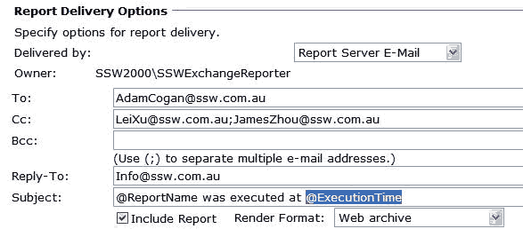
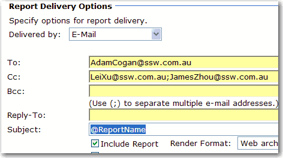

In subscription settings, @ExecutionTime should be removed from subject, because it ruins conversation threading in Outlook - You cannot sort them by subject.

<!--endintro-->

::: bad  
  
:::

So we always make subject of subscription exactly same as report name.

::: good  

:::
