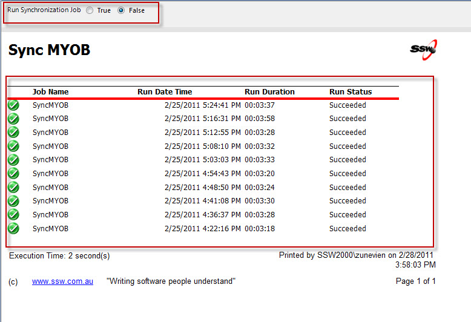

If you have a SQL database data source with data coming from an external source (i.e. MYOB), then you should create a report which allows user to manually refresh data.

<!--endintro-->

Your report should have:

* A checkbox/radio button which allows user to trigger the refresh.
* A table display the history of previous refresh including start time, duration and status...

::: good  

:::
