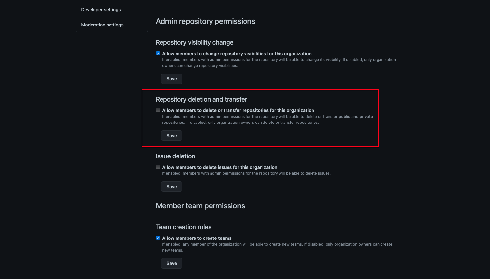

When deleting GitHub repositories, it can be hard to tell if you are on a fork or the base repository as the interface is very similar. This can lead to accidental deletions of base repositories.

<!--endintro-->

To avoid this, the organisation owners should be the only members allowed to delete repositories. Follow these instructions:

1. Go to your organisation | Settings | Member privileges.
2. Under 'Repository deletion and transfer', ensure 'Allow members to delete or transfer repositories for this organization' is **deselected**
3. Save

See GitHub docs [Setting permissions for deleting or transferring repositories](https://docs.github.com/en/github/setting-up-and-managing-organizations-and-teams/setting-permissions-for-deleting-or-transferring-repositories)

This will ensure that even Admin users cannot accidentally delete or transfer repositories

::: good

:::
