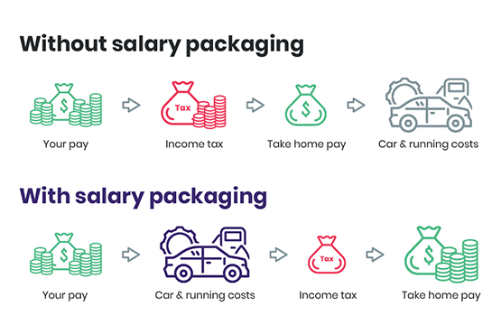

Salary sacrifice is an effective way to reduce your taxable income, allowing you to increase your take-home pay. It’s a financial arrangement where part of your pre-tax salary goes towards an approved expense, whether it’s a laptop, additional superannuation contributions, or even a car!

<!--endintro-->

When it comes to cars, this arrangement is known as a novated lease — a car financing option that lets employees treat their personal car as if it were a company car. It's a 3-way agreement between the employee, their employer, and the novated lease provider. 

As one of the most cost-effective car ownership options for Australians, a novated lease offers access to income tax and GST savings, additional fleet discounts, and the convenience of having a fully maintained car through the lease provider.

Under this arrangement, the employer deducts lease payments and car-related costs directly from the employee's pre-tax salary. The lease provider manages vehicle expenses, including finance, insurance, registration, maintenance, and fuel, which are bundled into the monthly payment.

Each pay period, the employer deducts the lease payments before tax, transferring these funds to the lease provider. This setup provides the employee with tax benefits and streamlines car ownership by combining all vehicle expenses into one, pre-tax payment. 

If the employee leaves the company, they take the lease with them, allowing for flexibility in continuing payments under a new employer or privately.
