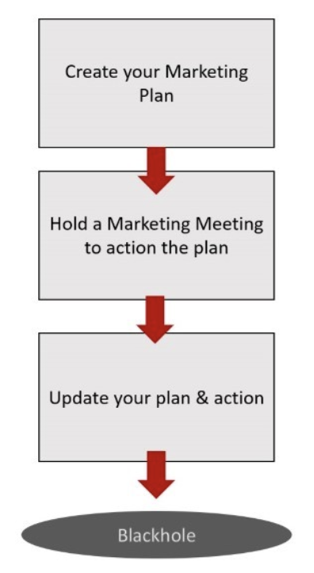
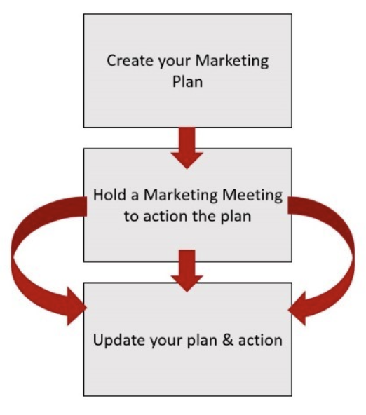

It is very easy to take days and multiple resources to write a Marketing Plan, so it is essential that you schedule meetings to update your Marketing plan at regular intervals. After each Marketing Meeting, we recommend that you book the next meeting immediately so that you have time to plan and prepare ahead of time. This also makes your team regularly use and update your plan.

<!--endintro-->

::: bad  
  
:::

::: good  
  
:::
