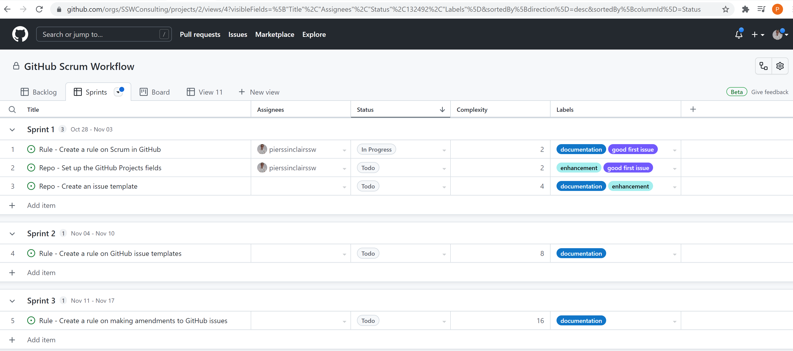
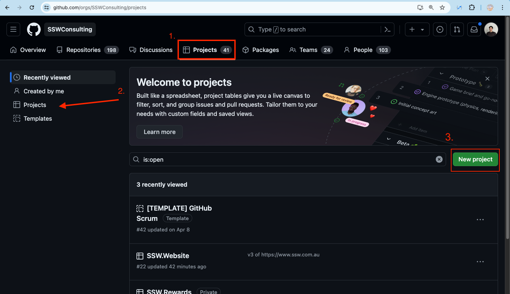
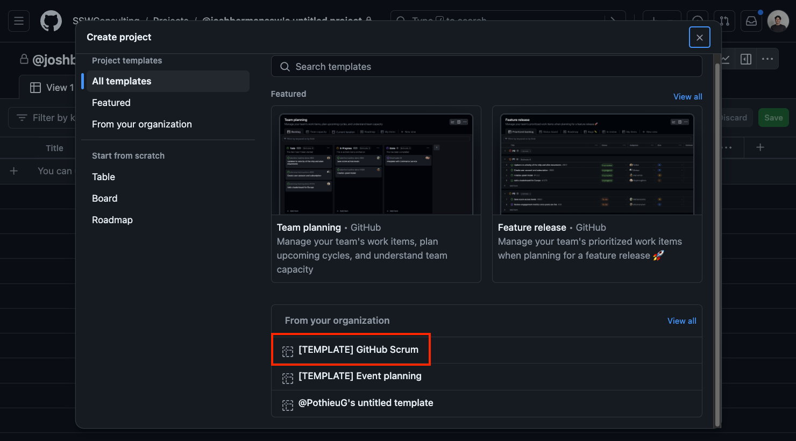
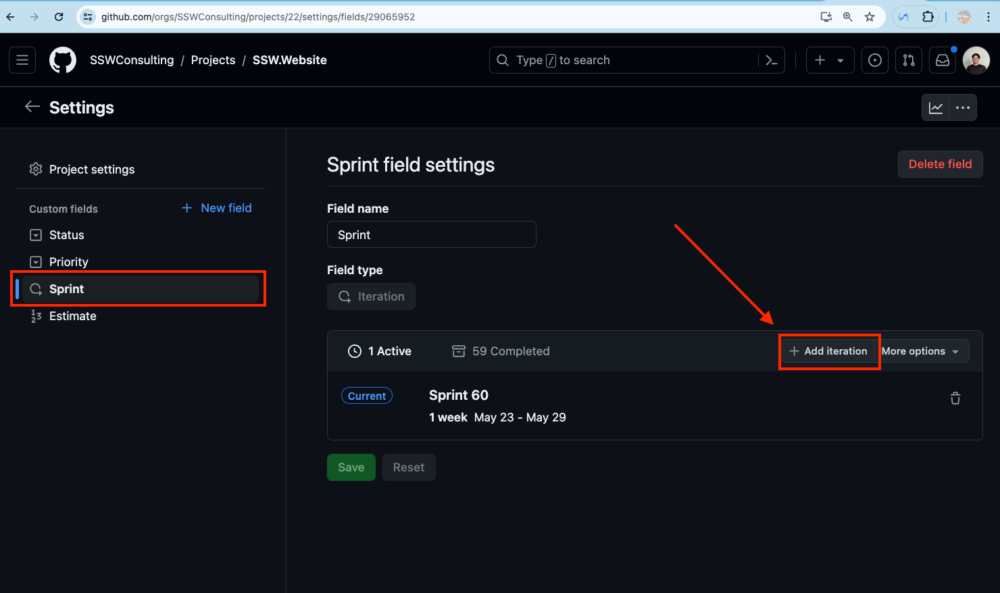
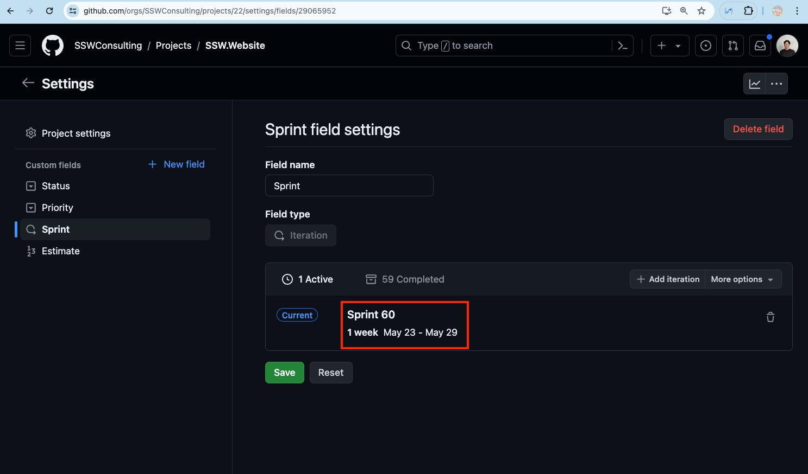
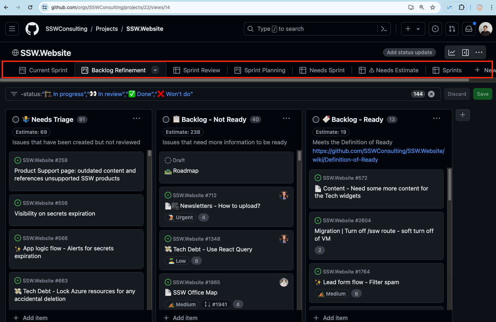
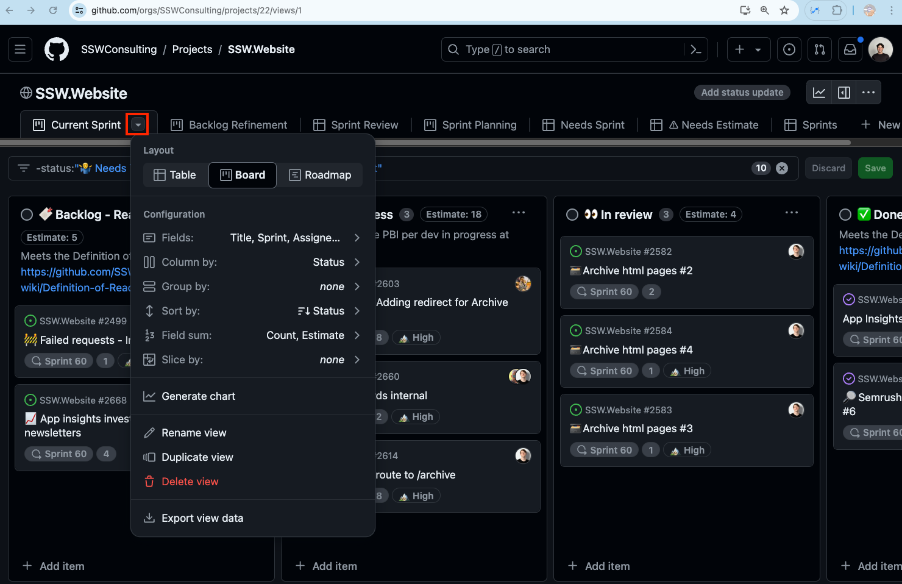
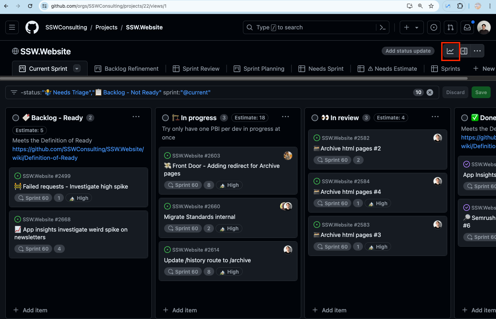
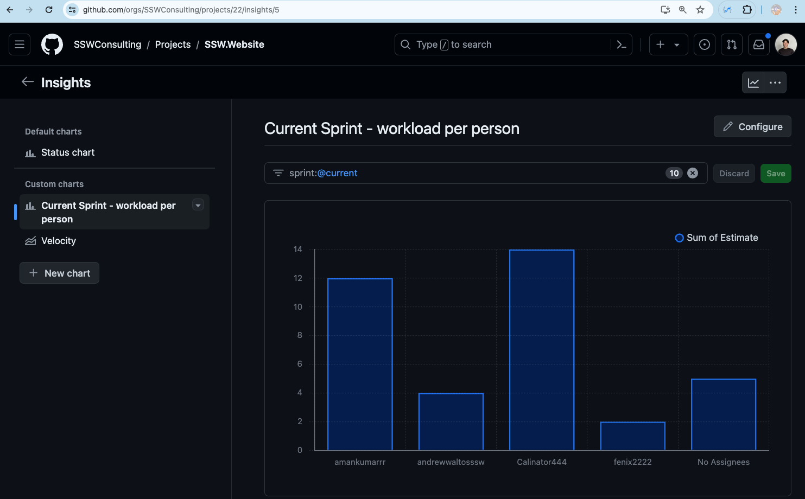

GitHub is an awesome place to manage your code, but initially it wasn't the easiest place to manage Scrum. Things improved in 2021 with GitHub Projects.

[GitHub Projects](https://docs.github.com/en/issues/trying-out-the-new-projects-experience/about-projects) lets you create Sprints and manage Issues (aka PBIs or Tasks) with far more power.

<!--endintro-->

`youtube: qT0VMdx7vuI`

**Video: Building your backlog with Projects (3 min)**

Let's take a look at some of the great new things you can do...

* Track Sprints
* Track estimates
* Add custom fields to Issues
* Collate Issues from multiple Repos

::: good

:::

### Setting up

That's a tonne of awesome features....but it requires a bit of set up, follow these steps to get up and running:

1. Navigate to **Projects | Projects | New project**

   

2. Now we have the option to create a project from a template or from blank. Here is a great template [[Template] GitHub Scrum](https://github.com/orgs/SSWConsulting/projects/42/views/1)

   

3. We now want to setup our Sprint iteration. Navigate to **Project Settings | Sprint | + Add Iteration**

   

4. You will see your new Sprint created with settings. Click on the field you wish to edit to modify - name it **Sprint ‘X’** and enter **Start on** date and **Duration**.

   

5. We can now navigate through the project via the **view bar**. This will provide us the different dashboards for seperate elements of our projects.

   

6. To modify a new view, select the down arrow next to the view name. This will allow you to customize views to your desired purpose.

   **Note**: To see the Sprints grouped, and the issues ordered by status, click the view drop down and select **group:Sprint** and **sort:Status-asc**

   

7. Voila! You have Scrum all setup! For bonus points check out the insights screen where we can gather specific data about our teams work.

   

   
