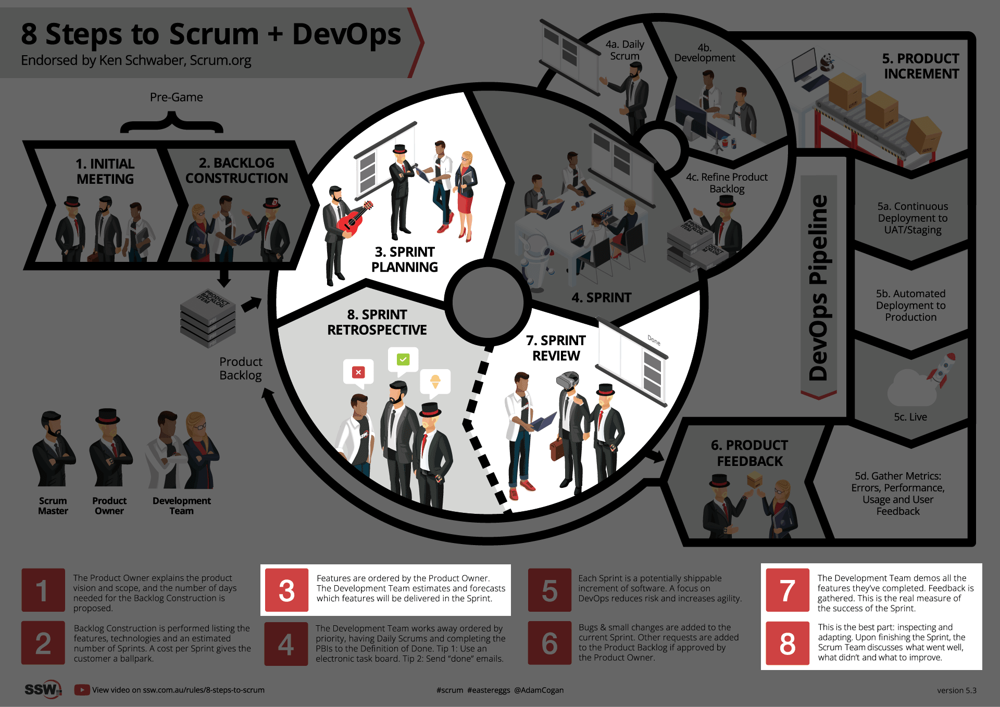
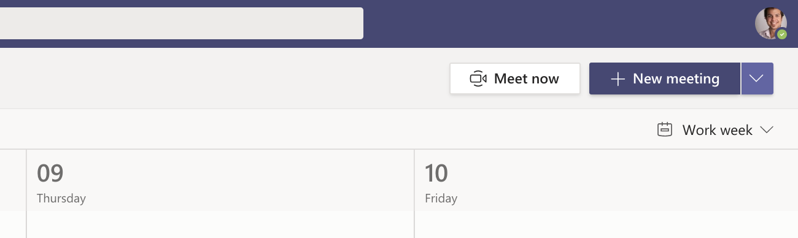

The Scrum Master plays a key role in the Scrum framework by scheduling and facilitating 3 crucial meetings: the Sprint **Review**, **Retrospective**, and **Planning**. These meetings are essential for reviewing progress, reflecting on performance, and planning future work, helping the team stay aligned and continuously improve.

<!--endintro-->

The Scrum Master should schedule a single calendar appointment to cater to the 3 meetings. When scheduling the calendar appointment, keep in mind the following:

## Time-boxing

The Scrum Master should estimate how much time each meeting will require. Ideally, each of the 3 key Sprint meetings should be limited to one hour or less per week. This time-boxing ensures that meetings remain focused and efficient, preventing them from running longer than necessary.

## Importance of breaks

Regular breaks are essential for maintaining productivity and focus. If a meeting runs longer than the planned one hour, having short breaks can help keep the team engaged and reduce fatigue, ultimately improving overall performance and participation.

## Updating the product backlog

After the Sprint Retrospective and before the next Planning meeting, the Scrum Team, with the Product Owner's assistance, should allocate time to update the Product Backlog. This step ensures that the team has clear priorities and tasks for the upcoming Sprint.

## Sprint start and end

The Sprint officially ends with the Sprint Retrospective meeting, while the Sprint Planning meeting signifies the beginning of the next Sprint. This structure helps maintain a clear cycle for continuous improvement.

## Flexible scheduling of meetings

Sprint meetings don’t have to be held on specific days like Fridays or Mondays. Scheduling them mid-week can often help avoid conflicts with long weekends or public holidays.

## Recurring calendar appointments

Since Sprint meetings occur regularly, it's best to set them up as recurring calendar events. This approach ensures that all team members have the necessary time blocked out in advance, helping with better planning and time management.

::: greybox
Learn more about the meetings in Scrum:

* [Sprint Planning Meeting](/what-happens-at-a-sprint-planning-meeting)
* [Sprint Review Meeting](/what-happens-at-a-sprint-review-meeting "Sprint Review Meeting")
* [Sprint Retrospective Meeting](/what-happens-at-a-sprint-retrospective-meeting "Sprint Retrospective Meeting")
* [Daily Scrum (Stand-up) Meeting](/meeting-do-you-update-your-tasks-before-the-daily-scrum "Daily Scrum Meeting")

**Tip:** It can be helpful to finish the **Sprint Planning meeting** with the first **Daily Scrum** of that Sprint.
:::

## Scheduling the meetings

Schedule the meeting and invite the Scrum Team and any interested stakeholders.

::: email-template

| | |
| -------- | --- |
| Required Attendees: | Scrum Team |
| Optional Attendees: | Interested Stakeholders |
| Recurrence: | Every **{{ NUMBER OF WEEKS }}** weeks |
| Subject: | {{ PROJECT NAME }} – Sprint Review, Retro and Planning |
::: email-content

### Hi Team

* Product Owner: {{ PRODUCT OWNER }}
* Stakeholders: {{ LINK TO LIST OF STAKEHOLDERS }}
* Scrum Master: {{ SCRUM MASTER }}
* Sprint Length: {{ NUMBER OF WEEKS }} weeks

This is a calendar appointment to hold the following 3 Scrum meetings:

**Sprint Review Meeting**

We will go through the user stories that have been completed and demonstrate them.\
See rule [What happens at a Sprint Review Meeting?](/do-you-know-what-happens-at-a-sprint-review-meeting)

**Sprint Retrospective Meeting**

Sprint closed and new Sprint starts.  
We ask for feedback of the previous Sprint so that we can ‘Inspect and Adapt’.\
See rule [What happens at a Sprint Retrospective Meeting?](/do-you-know-what-happens-at-a-sprint-retrospective-meeting)

**Sprint Planning Meeting**

We go through the backlog (aka to-do list), get more information, estimate and then prioritize.\
We then breakdown to tasks and commit to what we believe we can deliver for the next Sprint.\
See the rule [What happens at a Sprint Planning Meeting?](/what-happens-at-a-sprint-planning-meeting)

Regards,
{{ SCRUM MASTER }}

&lt;This email is as per the rule [https://www.ssw.com.au/rules/scrum-master-do-you-schedule-the-3-meetings](/scrum-master-do-you-schedule-the-3-meetings) /&gt;

:::
:::
::: good
Figure: Good example - Copy this appointment template and send to the Scrum Team
:::

::: good

:::

**Tip:** See more information on [when to send an Appointment or a Teams Meeting](/send-appointment-or-teams-meeting).
