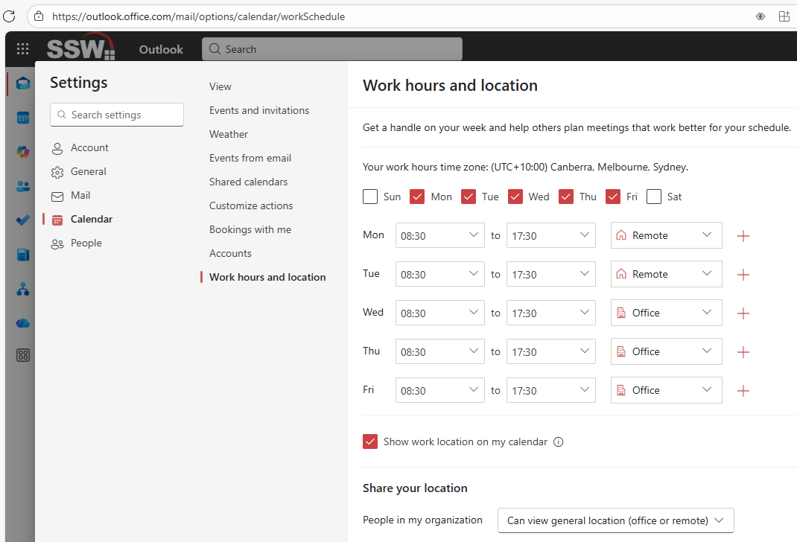
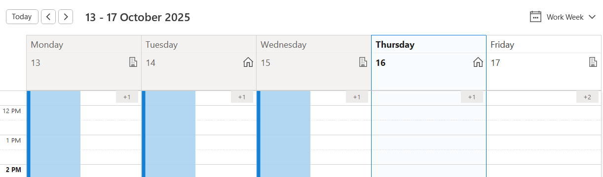
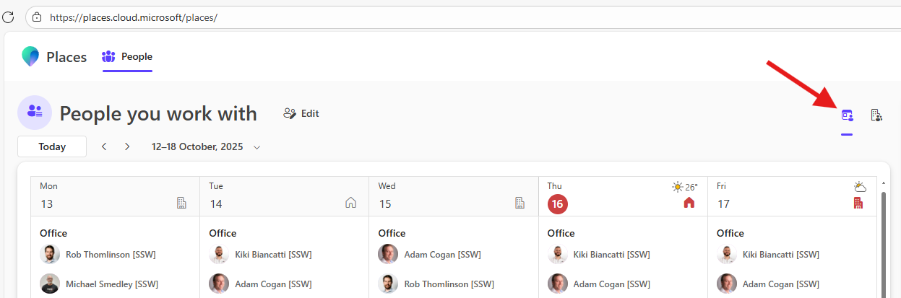

Working from home is common these days, so it is beneficial to let your colleagues know when you're in the office and when you're working remotely.

This can be done through Outlook or Teams, and it will appear on your Calendar in both apps - as well as in [Microsoft Places](https://www.microsoft.com/en-us/microsoft-teams/microsoft-places).

<!--endintro-->

## Setting your working location

1. Open the settings in your preferred app:

    * **Teams:** Go to **Calendar | Calendar Settings | Work hours and location**
    * **Classic Outlook:** Go to **File | Options | Calendar | Work hours and location**
    * **New Outlook & Outlook on the web:** Go to **Settings | Calendar | Work hours and location**

2. If you haven't already, set your working days and hours - as per [Calendar - Do you set your work hours in CRM and your Outlook calendar?](https://www.ssw.com.au/rules/calendar-do-you-set-your-work-hours-in-your-calendars/)
3. Select **Office** or **Remote** for each of your working days
4. Tick **Show work location on my calendar**
5. Under **Share your location**, select **Can view general location**

::: info
**Note:** Remember to update your location if it changes.
:::

## View your colleagues' locations

To see if your colleagues are planned in the office or remote, simply view their calendar in Outlook or Teams.

For a view of everyone you work with and their location, go to **places.cloud.microsoft** and select **Show in office summary**.

