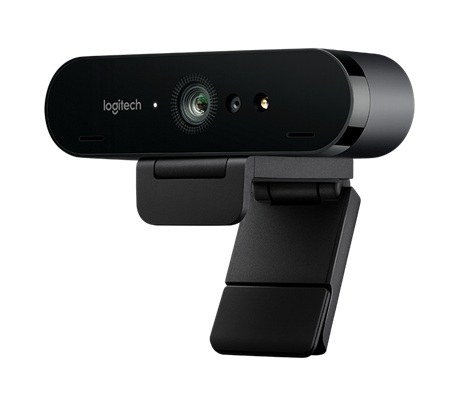
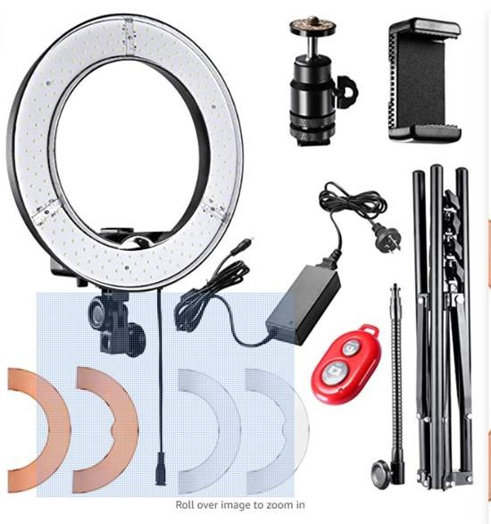

Many businesses have made the transition to working from home (WFH). It’s important to still be able to easily and clearly communicate with your colleagues and externals.

<!--endintro-->

Without a spare room, it can be difficult to create a workable setup, however as you will see in the following examples, it is easy to create a clean and workable setup with a few smart tricks.

### Tip #1: Use a room divider

Christian has used a folding room divider to hide his background and create something visually nice to look at.

It has the added effect of softening any background light, e.g. windows, lamps etc.

### Tip #2: Off angle camera

Jason’s setup is another good example:

In this setup, Jason is using a more ‘pro’ setup with a USB powered podcasting mic and an articulating arm. He is also using a high-quality webcam with a ring light.

Originally the shot was more head-on, which meant you could see the bed in full view, however by moving the webcam off to the side and using the blinds, we can get a more pleasant looking shot.

For remote video recordings and User Groups, this is an ideal setup.

### Tip #3: Get awesome audio

One of the most frustrating aspects of remote calls is participants’ mixed audio quality. To minimize any issues, there are several different devices you can consider purchasing:

**USB webcam with built-in mic array**

::: good
Benefits

:::

- Improves audio \*and\* video quality compared to the built-in webcam
- ‘One-stop-solution’; easy to install and will work on both laptop and desktop systems

**Podcast style microphone**

::: good
Benefits

:::

- High-quality audio will be very useful if you plan to record videos. e.g. done videos
- You look cool

### Tip #4: Improve video with lighting

The best way to improve your video is not to buy a new fancy camera, but to improve your existing setup with great lighting.

::: good
Benefits

:::

- Drastically improves video quality
- Adds professional spark to your presentation
- This kit allows you to use a webcam or smartphone via Bluetooth
