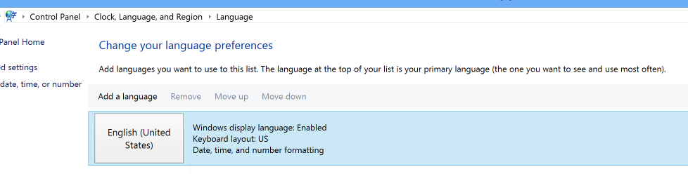

Did you know that all pilots around the world must speak English? Back then, the decision of what language to use was English, since the US invented the first plane. Like the sky, in the web world, it is better to use one version of English. Since the US invented the web, let's go with that.

<!--endintro-->

If you are an Australian or British this rule is controversial, but it is worth it for the following reasons:

* Aim for the majority. Most web traffic is from American users and they expect American (most probably will assume anything different is an error)
* SEO - On the practical side, more web searches are going to be returned for US spelling of words.

::: good  
  
:::

Don't forget to check your pages for spelling errors after making edits.
