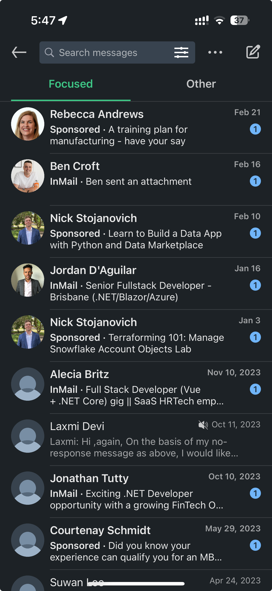

Developers receive a lot of reachouts. Sometimes they are automated and other times they are a person copying and pasting the same message to everyone.

To have your reachout rise above the noise, you need to make it personal and unique.

<!-- endintro -->

::: img-small bad

:::

Here are some tips to make your reachouts stand out:

1. **[Use emojis](/use-emojis)** - A few emojis can make your message stand out, and feel more personal
2. **Ask a question** - Most reachouts don't have a proper call to action, they simply ask you to "get in touch". Asking a question engages the candidate and makes them more likely to respond  
E.g. If you see someone is learning Rust, you could ask "How long have you been learning Rust? We have a few "Rustaceans" in the SSW Brisbane office 🦀"  
It's important to ask the question early in the message, as most people will only glance at the message
3. **Add a video** - Add a YouTube link to a video that tells the candidate why your company is awesome, this will make them more engaged and more likely to respond
   E.g., [Why work at SSW?](https://www.youtube.com/watch?v=tWuutobJtdg)

::: greybox
Hi Bob 👋,

I hope you're well! My name is Brady, and I work as a Software Engineer at SSW. I wanted to reach out to you because we're currently looking for a Senior Software Engineer to join our team in Brisbane, and I think you could be a great fit.

How long have you been doing Rust?
We have a few "Rustaceans" in the Brisbane office 🦀
:::
::: good
Figure: Good example - Message contains emojis and has a relevant question
:::
