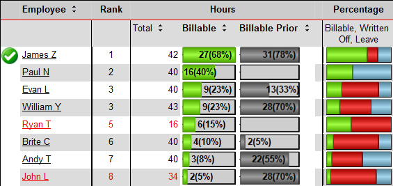
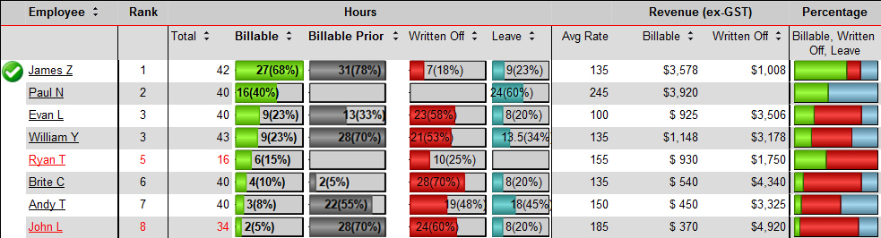

In the vast majority of cases where the readership of the report is wide, some viewers like or need great detail while others just need a quick summary.

<!--endintro-->

::: bad  
  
:::

::: good  

:::
