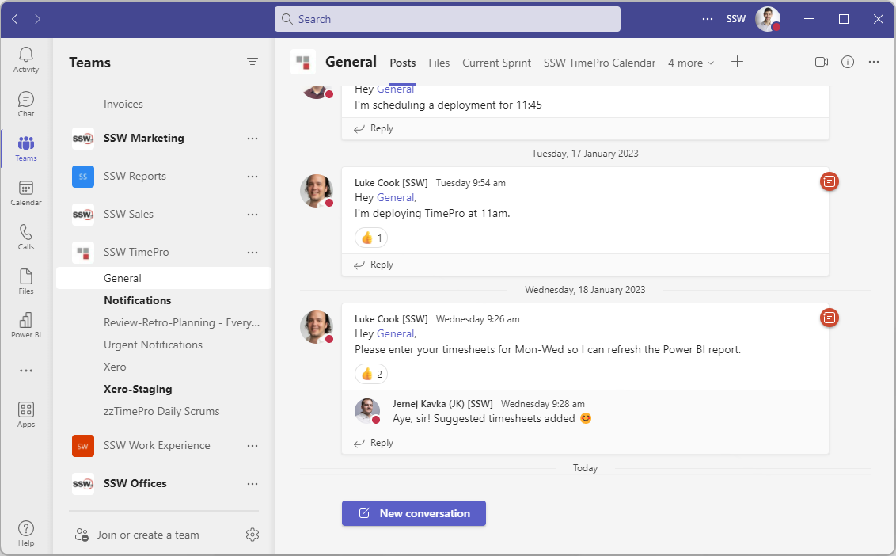
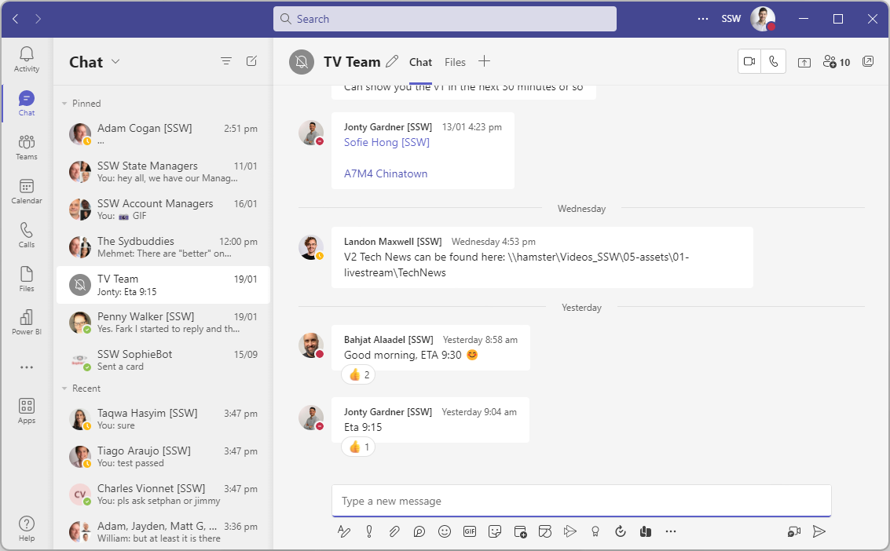

Teams is a powerful way to chat, collaborate, and video call with your project team. As soon as you start a new project, create a group chat with all the team members (potentially including the client if appropriate).

Although you will also have a dedicated Team (as per [SSW.Rules | Do you know how to create a Team?](/create-a-team)), which is great for storing documents and files, as well as persisting notifications, you’re better to communicate in a chat rather than a channel.

**✅ Pros**

* You will be actively notified of new messages
* The conversation flows more naturally (rather than threaded)
* You can quickly call the whole team into a video call

**❌ Cons**

* People cannot add themselves to a chat so will need someone on the team to add them
* In larger teams, the lack of conversation threading may become an issue

::: bad

:::

::: good

:::

:::info
💡 **Tip:** You often need to add someone to a chat, and sometimes it's a good idea to share all history with them to provide context. However, sometimes the contents of a chat can be sensitive and shouldn't be shared. In this cases you should think carefully before adding someone to a chat, and doubly so before sharing history with them.

To make these sensitive chats easier to identify, rename them something appropriate (that doesn't give away the sensitivity in case you're sharing your screen), and **[use a padlock emoji (🔒) at the start of the chat name](/use-emojis) as a mental shortcut to indicate not to share it**.
:::
