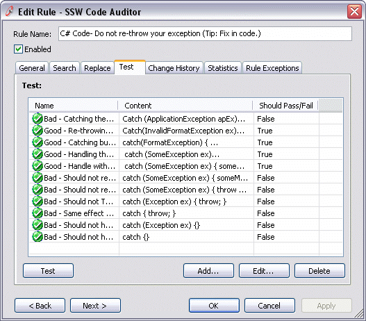

Everyone writes unit tests for their code, because it helps developer to make changes in future without breaking existing functionalities. The same goes for regular expressions. A good regular expression will have a set of test cases to make sure any future changes does not invalidate existing requirements.

<!--endintro-->

You should not fix a regular expression until we have added a good and a bad test case.

If your application is driven by regular expressions, you need a good test harness. Here is an example of a test harness we use in CodeAuditor.

