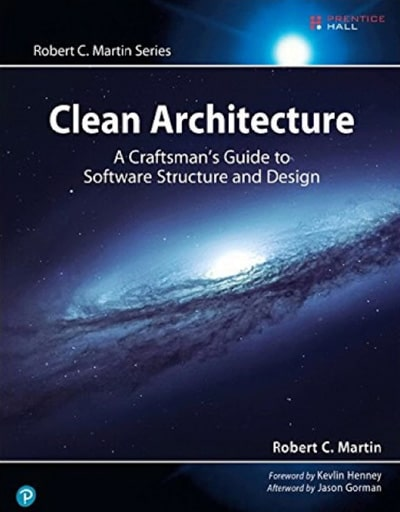
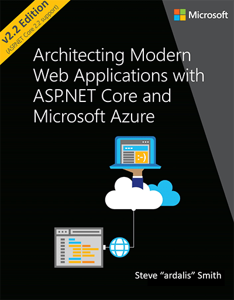

There are many great resources for learning the principles of Clean Architecture, but a the best place to start is with Jason Taylor’s videos:

<!--endintro-->

`youtube: https://www.youtube.com/embed/5OtUm1BLmG0`

**Video: Clean Architecture with ASP.NET Core 3.0 - Jason Taylor - NDC Sydney 2019 (1 hr)**

`youtube: https://www.youtube.com/embed/_lwCVE_XgqI`

**Video: Clean Architecture with ASP.NET Core 2.1 | Jason Taylor (49 min)**

Check out the [Awesome Clean Architecture repo](https://github.com/sswconsulting/awesome-clean-architecture) for a community driven up-to-date list of CA resources.

## Further reading

Start with Robert C. Martin (aka ‘Uncle Bob’)’s blog post: [The Clean Architecture](http://blog.cleancoder.com/uncle-bob/2012/08/13/the-clean-architecture.html).

Then, check out this book by Robert C. Martin should be anyone’s starting point for reading further:

Also, this resource by Steve Smith is available as an online e-book and contains up-to-date specific examples for ASP.NET Core and Azure:

## Courses

* [SSW - Clean Architecture Dev Superpowers Tour](https://www.ssw.com.au/events/clean-architecture-superpowers-tour)
* [SSW - Clean Architecture Hands on 2-day Workshop](https://www.ssw.com.au/events/clean-architecture-workshop)
* [Pluralsight - Clean Architecture: Patterns, Practices, and Principles](https://www.pluralsight.com/courses/clean-architecture-patterns-practices-principles)
