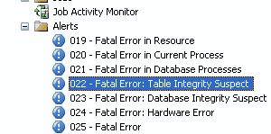

SQL Alerts are valuable because they can alert administrators of imminent SQL Server failures. e.g. when the msdb log file is full. To enable, you should change the settings under SQL Server Agent.

<!--endintro-->

SQL has no default alerts. You will have to create them, and I recommend that you add all the fatal level exceptions to alerts.

