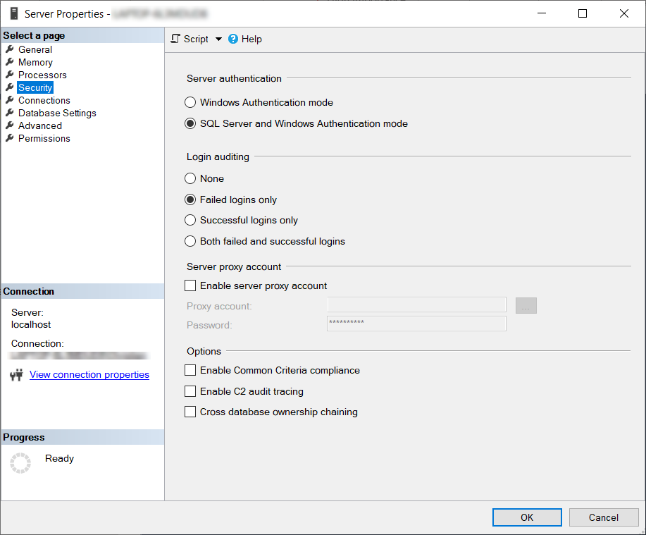

Configure login security auditing:

- Not on by default
- Configure on the security tab of Server Properties in SQL Server Management Studio
- Enable for Failure
- View using the Windows Event Viewer

<!--endintro-->

  
**Note:** You can turn on a trace for SQL DDL operations statements.
