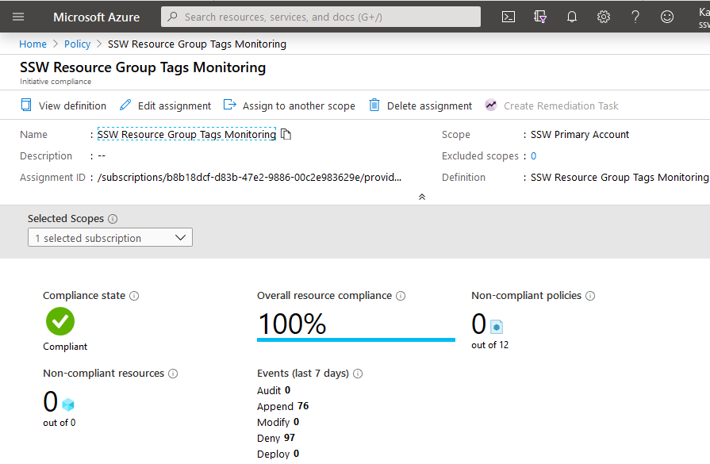

If you use a strong naming convention and is using Tags to its full extent in Azure, then it is time for the next step.

Azure Policies is a strong tool to help in governing your Azure subscription. With it, you make it easier to fall in The Pit of Success when creating or updating new resources. Some features of it:

<!--endintro-->

1. You can deny creation of a Resource Group that does not comply with the naming standards
2. You can deny creation of a Resource if it doesn't possess the mandatory tags
3. You can append tags to newly created Resource Groups
4. You can audit the usage of specific VMs or SKUs in your Azure environment
5. You can allow only a set of SKUs within Azure

Azure Policy allow for making of initiatives (group full of policies) that try to achieve an objective e.g. a initiative to audit all tags within a subscription, to allow creation of only some types of VMs, etc...

You can delve deep on it here: https://docs.microsoft.com/en-us/azure/governance/policy/overview

::: good  
  
:::
