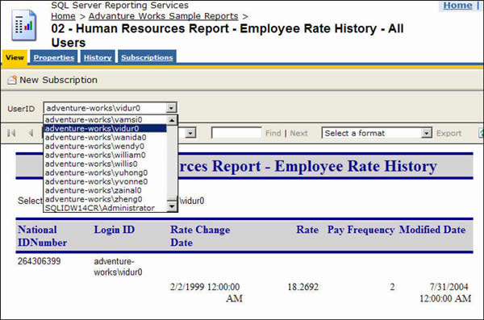
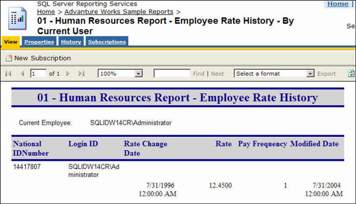

<!--endintro-->

Payroll report should only show the records of the current user, Reporting Services support "Integrated Security" which you can use to identify the user who is running the report and only return relevant result for the current user.

::: bad  
  
:::

::: good  

:::

To generate such a report, you need to use the filter on the data table:

Note: 'Edit Expression' dialog is only available on RS 2005, but the UserID global variable is available on RS 2000.
