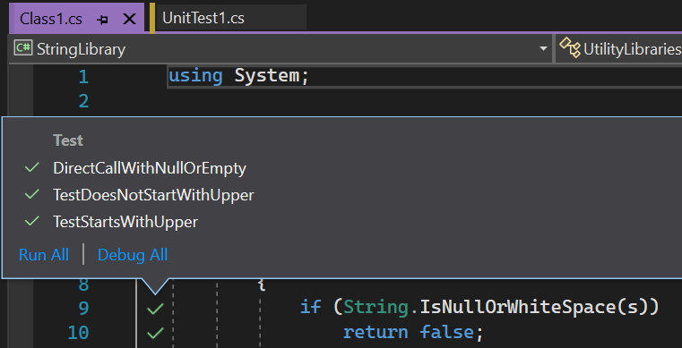

By enabling Live Unit Testing in a Visual Studio solution, you gain insight into the test coverage and the status of your tests.

Whenever you modify your code, Live Unit Testing dynamically executes your tests and immediately notifies you when your changes cause tests to fail, providing a fast feedback loop as you code.

:::greybox
**Note:** The Live Unit Testing feature requires Visual Studio Enterprise edition
:::

<!--endintro-->

To enable Live Unit Testing in Visual Studio, select Test | Live Unit Testing | Start

You can get more detailed information about test coverage and test results by selecting a particular code coverage icon in the code editor window:

::: greybox
**Tip:** If you find a method that isn't covered by _any_ unit tests, consider writing a unit test for it. You can simply right-click on the method and choose Create Unit Tests to add a unit test in context.
:::

For more details see [Joe Morris’s video on .NET Tooling Improvements Overview – Live Unit Testing](https://www.youtube.com/watch?v=kBlLi4BYCKk).
