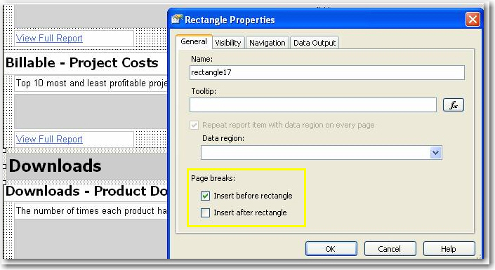
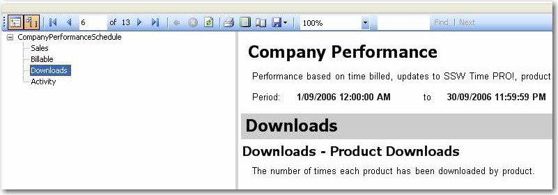

Sometime you want your report to break at somewhere to separate different part of content into individual pages. A logical page break is what you need.
<!--endintro-->

Logical page breaks are defined in the report definition by using the PageBreakAtStart and PageBreakAtEnd properties in various report elements, including group, rectangle, list, table, matrix, and chart.

Here is an example of how we add logical page breaks in a report to make each subreport start showing at right beginning in a new page.

