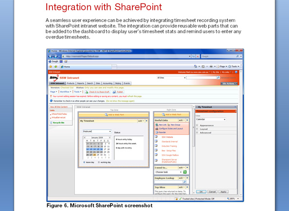

An image tells a thousand words. Using screenshots and pictures can help selling your ideas and add confidence to your proposals by giving visual examples of similar projects you have done.

<!--endintro-->

