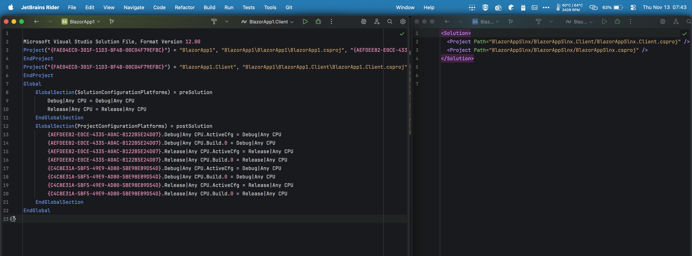

The traditional `.sln` format has served developers well for years, but it comes with significant limitations that impact productivity and collaboration, especially as projects grow larger and teams expand. The modern SLNX format solves these problems with a clean XML-based structure.

<!--endintro-->

## ❌ Problems with the traditional .sln format

1. **File Size** - Solution files can become extremely large (1,000+ lines) making them difficult to work with
2. **Merge Conflicts** - The verbose, proprietary format frequently causes merge conflicts when multiple developers add projects simultaneously
3. **Maintainability** - The format is difficult to read and understand, making manual edits error-prone
4. **Poor Diffs** - Changes are hard to review in pull requests due to the verbose format

These issues become increasingly problematic as your codebase grows to include numerous modules and projects, with frequent additions by multiple team members.

## ✅ Benefits of using SLNX format

The SLNX (XML-based) format addresses these core issues:

1. **Dramatic file size reduction** - Typical 88% reduction (e.g., from 1,477 lines to 171 lines)
2. **XML-based format** - More readable and maintainable
3. **Reduced merge conflicts** - Cleaner structure makes conflicts less likely
4. **Better tooling support** - Easier to automate solution file management
5. **Future-proof** - Aligns with Microsoft's direction for solution files
6. **Maintains functionality** - All existing project references, solution folders, and dependencies are preserved



Check out Microsoft's documentation on SLNX  
<https://devblogs.microsoft.com/dotnet/introducing-slnx-support-dotnet-cli/>

::: info
**Tip:** You can easily convert your existing `.sln` files to `.slnx` format using the .NET CLI:

```bash
dotnet sln migrate MySolution.sln
```

This will create a new `.slnx` file alongside your existing `.sln` file.
:::

## ⚠️ Considerations

For most solutions, switching to SLNX will be seamless and not require any changes.

* Requires Visual Studio 2022 17.0 or later - ensure your whole team is on a compatible version
* Some older tooling may not support SLNX format

## 📚 More Information

* [Microsoft Documentation: SLNX Solution Format](https://learn.microsoft.com/en-us/visualstudio/ide/solution-file-format)
