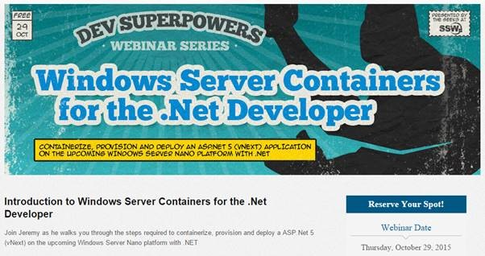
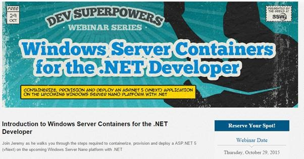

With so many different capitalization conventions used in technology names, it can be confusing to know which convention to use for which technology.

<!--endintro-->

The main 5 types used are:

1. All uppercase – ALL UPPERCASE
2. All lower case – all lowercase
3. Pascal case - PascalCase
4. Camel case – camelCase
5. Only first letter capitalized - Onlythefirstletter

Here’s a quick overview:

- **.NET** - All uppercase
- **DevOps** - Pascal case
- **JavaScript** - Pascal case
- **jQuery** - Camel case
- **Angular** (previously AngularJS) - Only first letter capitalized
- **SharePoint** - Pascal case
- **email** - All lowercase
- **MVC** - All uppercase
- **CRM** - All uppercase
- **SAP** - All uppercase
- **Salesforce** - Only first letter capitalized
- **gulp** - All lowercase
- **Agile** - Only first letter capitalized
- **Scrum** - Only first letter capitalized
  (Note: Scrum is not an acronym, so it should never be spelled "SCRUM") |

::: bad  
  
:::

::: good  
  
:::
