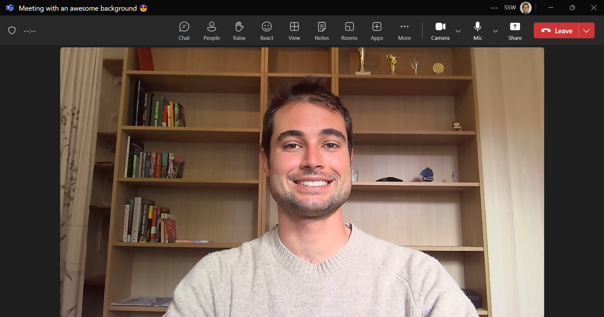
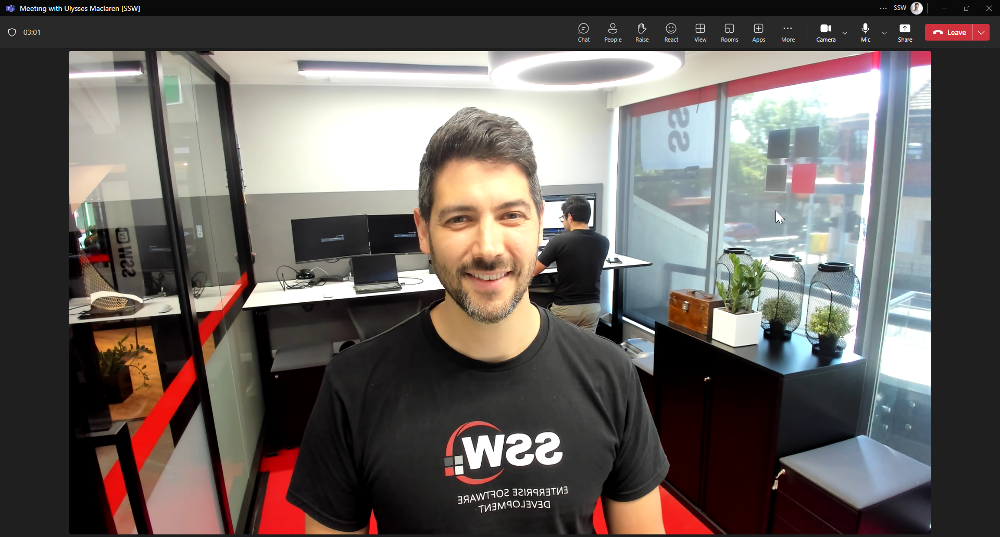
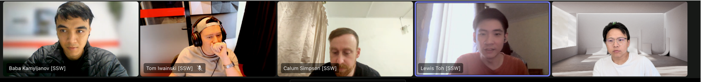

You are likely to have constant Teams or Zoom video calls with clients or work colleagues. One of the first things you should think about should be how to have a nice background.

<!--endintro-->

## Home offices

For home offices, follow "less is more" - A neutral background, good lighting, and a clutter-free space can significantly enhance the quality of your video.

* Have a neutral wall or setup behind you or with minimal objects - you may be fond of family pictures or band posters, but the person on the other side may be distracted
* Check you don't have a pile of clothes to fold, boxes, or any mess that may be behind your desk
* [Good lighting](/have-good-lighting-on-your-home-office) can improve the general quality of your video
* If you want to go the extra mile, designate one wall as your company wall and keep it consistent with the company branding

::: greybox
**Test your background** - Start by sitting at your desk and taking a selfie to check your background. Use this as a guide to tidy and organize your space for a more professional appearance.
:::

::: bad

:::

::: ok

:::

::: good

:::

## On-site offices

When you're in the office, it's easy to have a professionally branded background, which remains the most effective option.

::: good

:::

### Virtual/Blur backgrounds (⚠️ not preferred)

Ideally you should have a clean, professional background (like in an office).

While **not** preferred, virtual/blur backgrounds can be used when your background has unavoidable clutter or distracting elements. The virtual/blur effect should be your last resort - only use it when your physical background is genuinely unprofessional.

::: bad

:::

::: good

:::

* **Teams** - [Custom backgrounds in Microsoft Teams](https://www.microsoft.com/en-us/microsoft-365/blog/2020/06/12/custom-backgrounds-microsoft-teams-video-meetings-fun-comfortable-personal/?WT.mc_id=M365-MVP-33518) make video meetings more fun, comfortable, and personal
* **Zoom** - [Virtual background](https://support.zoom.us/hc/en-us/articles/210707503-Virtual-Background) feature allows you to display an image or video as your background during a Zoom meeting
