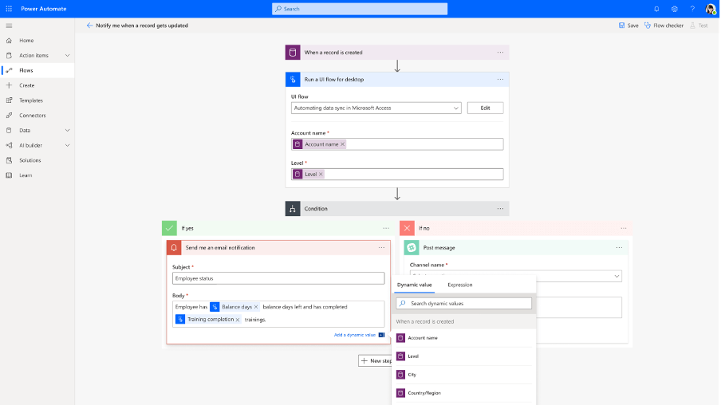
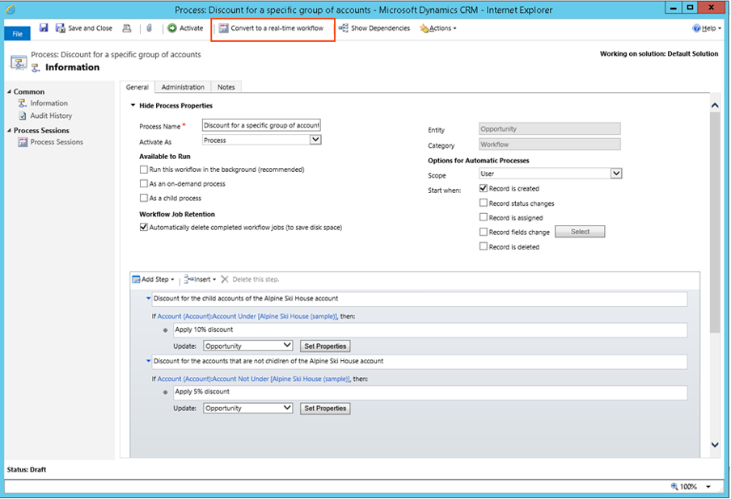

When creating workflows for Model-Driven Apps using Power Automate is now the suggested and for most scenarios the preferred workflow engine. Using Power Automate is simply a nicer experience compared to using the legacy workflow editor, with the ability to connect to over 300 connectors, visual editor, excellent expression editor that the built-in workflow editor simply can’t touch.

<!--endintro-->

There is one scenario where the built-in workflow engine is preferred and that is when a synchronous workflow is needed. A synchronous workflow means that all operations will wait until the workflow is completed. An example of this could be synchronous workflow being trigger on save of a record. You can be certain that when the user gets control back after saving the record that the workflow would have finished running. This is important in some instances, as with an asynchronous workflow (like Power Automate) the workflow will be triggered on save and the App will continue running as normal.

